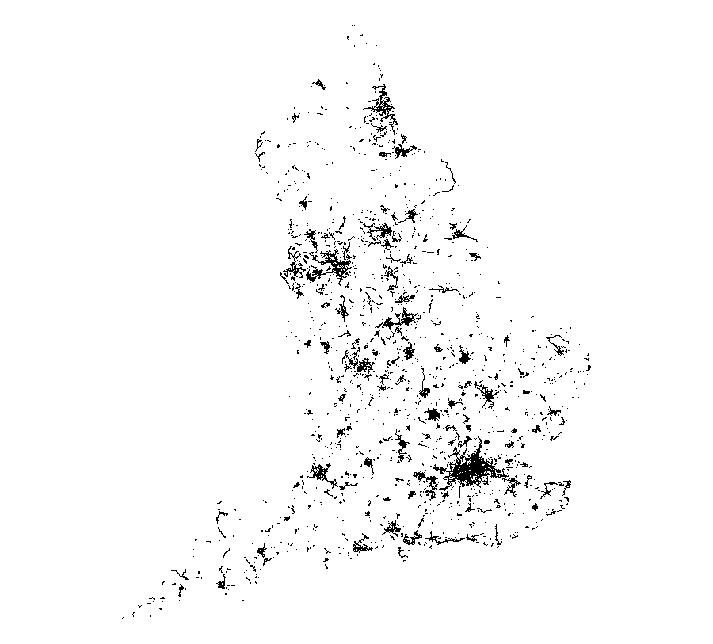

<!-- README.md is generated from README.Rmd. Please edit that file -->

```{r, include = FALSE}
knitr::opts_chunk$set(
  collapse = TRUE,
  comment = "#>",
  fig.path = "man/figures/README-",
  out.width = "100%"
)
```

<!-- README.md is generated from README.Rmd. Please edit that file -->

# osmextract

<!-- badges: start -->

[](https://github.com/ropensci/osmextract/actions)
[](https://codecov.io/gh/ropensci/osmextract?branch=master)
[](https://github.com/ropensci/software-review/issues/395)
[](https://www.repostatus.org/#active)
[](https://CRAN.R-project.org/package=osmextract)
<!-- badges: end -->

The goal of `osmextract` is to make it easier for people to access OpenStreetMap (OSM) data for reproducible research.
OSM data is the premier source of freely available, community created geographic data worldwide.
We aim to enable you to extract it for data-driven work in the public interest.

`osmextract` finds, downloads, converts and imports bulk OSM data hosted by providers such as [Geofabrik GmbH](http://download.geofabrik.de) and [bbbike](https://download.bbbike.org/osm/).
For information on alternative providers and how to add them see the [providers vignette](https://docs.ropensci.org/osmextract/articles/providers.html).

## Why osmextract?

The package answers a common question for researchers who use OSM data:
how to get it into a statistical environment, in an appropriate format, as part of a computationally efficient and reproducible workflow?
Other packages answer parts of this question.
[`osmdata`](https://github.com/ropensci/osmdata), for example, is an R package that provides an R interface to the [Overpass API](https://wiki.openstreetmap.org/wiki/Overpass_API), which is ideal for downloading small OSM datasets.
However, the API is rate limited, making it hard to download large datasets.
As a case study, try to download all cycleways in England using `osmdata`:

```r
library(osmdata)
cycleways_england = opq("England") %>% 
  add_osm_feature(key = "highway", value = "cycleway") %>% 
  osmdata_sf()
# Error in check_for_error(doc) : General overpass server error; returned:
# The data included in this document is from www.openstreetmap.org. The data is made available under ODbL. runtime error: Query timed out in "query" at line 4 after 26 seconds. 
```

The query stops with an error message after around 30 seconds.
The same query can be made with `osmextract` as follows, which reads-in almost 100k linestrings in less than 10 seconds, after the data has been downloaded in the compressed `.pbf` format and converted to the open standard `.gpkg` format. 
The download-and-conversion operation of the OSM extract associated to England takes approximately a few minutes, but this operation must be executed only once. 
The following code chunk is not evaluated.

```{r, eval = FALSE}
library(osmextract)

cycleways_england = oe_get(
  "England",
  quiet = FALSE,
  query = "SELECT * FROM 'lines' WHERE highway = 'cycleway'"
)
par(mar = rep(0.1, 4))
plot(sf::st_geometry(cycleways_england))
```

```{r, echo = FALSE, out.width="80%", fig.align='center'}

```

The package is designed to complement `osmdata`, which has advantages over `osmextract` for small datasets: `osmdata` is likely to be quicker for datasets less than a few MB in size, provides up-to-date data and has an intuitive interface. 
`osmdata` can provide data in a range of formats, while `osmextract` only returns [`sf`](https://github.com/r-spatial/sf) objects.

`osmextract`'s niche is that it provides a fast way to download large OSM datasets in the highly compressed `pbf` format and read them in via the fast C library [GDAL](https://gdal.org/drivers/vector/osm.html) and the popular R package for working with geographic data, [`sf`](https://github.com/r-spatial/sf).

## Installation

You can install the released version of `osmextract` from [CRAN](https://cran.r-project.org/package=osmextract) with:

``` r
install.packages("osmextract")
```

You can install the development version from [GitHub](https://github.com/ropensci/osmextract) with:

``` r
# install.packages("remotes")
remotes::install_github("ropensci/osmextract")
```

Load the package with:

```{r}
library(osmextract)
```

To use alongside functionality in the `sf` package, we also recommend attaching this geographic data package as follows:

```{r}
library(sf)
```

### Warnings: 

The functions defined in this package may return a warning message like 

```
st_crs<- : replacing crs does not reproject data; use st_transform for that 
```

if the user is running an old version of GDAL (<= 3.0.0) or PROJ (<= 6.0.0). 
See [here](https://github.com/r-spatial/sf/issues/1419) for more details. 
Nevertheless, every function should still work correctly. 
Please, raise [a new issue](https://github.com/ropensci/osmextract/issues) if you find any odd behaviour. 

## Basic usage

Give `osmextract` a place name and it will try to find it in a list of names in the specified provider ([Geofabrik](https://www.geofabrik.de/data/download.html) by default).
If the name you give it matches a place, it will download and import the associated data into R.
The function `oe_get()` downloads (if not already downloaded) and reads-in data from OSM extract providers as an `sf` object.
By default `oe_get()` imports the `lines` layer, but any layer can be read-in by changing the `layer` argument:

```{r, eval = FALSE, echo = FALSE}
# get bb of iow
tmaptools::geocode_OSM("isle of wight")
```

```{r points-lines-iow, fig.show = 'hold', out.width = "50%"}
osm_lines = oe_get("Isle of Wight", stringsAsFactors = FALSE, quiet = TRUE)
osm_points = oe_get("Isle of Wight", layer = "points", stringsAsFactors = FALSE, quiet = TRUE)
nrow(osm_lines)
nrow(osm_points)
par(mar = rep(0, 4))
plot(st_geometry(osm_lines), xlim = c(-1.59, -1.1), ylim = c(50.5, 50.8))
plot(st_geometry(osm_points), xlim = c(-1.59, -1.1), ylim = c(50.5, 50.8))
```

The figures above give an insight into the volume and richness of data contained in OSM extracts.
Even for a small island such as the Isle of Wight, it contains over 100k features including ferry routes, shops and roads.
The column names in the `osm_lines` object are as follows:

```{r}
names(osm_lines) # default variable names
```

Once imported, you can use all functions for data frames in base R and other packages.
You can also use functions from the `sf` package for spatial analysis and visualisation.
Let's plot all the major, secondary and residential roads, for example:

```{r iow1}
ht = c("primary", "secondary", "tertiary", "unclassified") # highway types of interest
osm_major_roads = osm_lines[osm_lines$highway %in% ht, ]
plot(osm_major_roads["highway"], key.pos = 1)
```

The same steps can be used to get other OSM datasets (examples not run):

```{r, eval = FALSE}
malta = oe_get("Malta", quiet = TRUE)
andorra = oe_get("Andorra", extra_tags = "ref")
leeds = oe_get("Leeds")
goa = oe_get("Goa", query = "SELECT highway, geometry FROM 'lines'")
```

If the input place does not match any of the existing names in the supported providers, then `oe_get()` will try to geocode it via [Nominatim API](https://nominatim.org/release-docs/develop/api/Overview/), and it will select the smallest OSM extract intersecting the area. 
For example (not run): 

```{r, eval = FALSE}
oe_get("Milan") # Warning: It will download more than 400MB of data
#> No exact match found for place = Milan and provider = geofabrik. Best match is Iran.
#> Checking the other providers.
#> No exact match found in any OSM provider data. Searching for the location online.
#> ... (extra messages here)
```

For further details on using the package, see the [Introducing osmextract vignette](https://docs.ropensci.org/osmextract/articles/osmextract.html).

## Persistent download directory

The default behaviour of `oe_get()` is to save all the files in a temporary directory, which is erased every time you restart your R session. 
If you want to set a directory that will persist, you can add `OSMEXT_DOWNLOAD_DIRECTORY=/path/for/osm/data` in your `.Renviron` file, e.g. with:

```{r, eval = FALSE}
usethis::edit_r_environ()
# Add a line containing: OSMEXT_DOWNLOAD_DIRECTORY=/path/to/save/files
```

We strongly advise you setting a persistent directory since working with `.pbf` files is an expensive operation, that is skipped by `oe_*()` functions if they detect that the input `.pbf` file was already downloaded.

You can always check the default `download_directory` used by `oe_get()` with: 

```{r, eval = FALSE}
oe_download_directory()
```

## Troubleshooting

Depending on the `.pbf` file selected and your connection speed, you may experience an error stating `Timeout of 60 seconds was reached`. 
If so, before calling `oe_get()`, you can adjust the timeout using `options(timeout = 300)`, choosing an appropriate value. 
This setting affects all calls to [download.file()](https://www.rdocumentation.org/packages/utils/versions/3.6.2/topics/download.file), so you may need to reset it for the rest of your script.

If you need to update an existing `.pbf` file or replace an incomplete extract, you can use the argument `force_download`. 
Check `?oe_get` and `?oe_download` for more details. 

## Next steps

We hope to make the user interface to the SQL syntax more user friendly.
We would love to see more providers added (see the [Add new OpenStreetMap providers](https://docs.ropensci.org/osmextract/articles/providers.html) for details) and see what people can do with OSM datasets of the type provided by this package in a reproducible and open statistical programming environment for the greater good.
Any contributions to support this or any other improvements to the package are very welcome via our issue tracker.

## Licence

We hope this package will provide easy access to OSM data for reproducible research in the public interest, adhering to the condition of the [OdBL licence](https://opendatacommons.org/licenses/odbl/) which states that

> Any Derivative Database that You Publicly Use must be only under the terms of:

- i. This License;
- ii. A later version of this License similar in spirit to this

See the [Introducing osmextract vignette](https://docs.ropensci.org/osmextract/articles/osmextract.html) for more details.

## Other approaches

<!-- todo: add links to other packages -->
- [osmdata](https://github.com/ropensci/osmdata) is an R package for importing small datasets directly from OSM servers
- [geofabrik](https://cran.r-project.org/package=geofabrik) is an R package to download OSM data from [Geofabrik](https://download.geofabrik.de/)
- [pyrosm](https://pyrosm.readthedocs.io/en/latest/) is a Python package for reading .pbf files
- [pydriosm](https://pypi.org/project/pydriosm/) is a Python package to download, read and import OSM extracts
- [osmium](https://pypi.org/project/osmium/) provides python bindings for the Libosmium C++ library
- [OpenStreetMapX.jl](https://github.com/pszufe/OpenStreetMapX.jl) is a Julia package for reading and analysing .osm files
- [PostGIS](https://www.bostongis.com/PrinterFriendly.aspx?content_name=loading_osm_postgis) is an established spatial database that works well with large OSM datasets
- Any others? Let us know!

## Contribution

We very much look forward to comments, questions and contributions. 
If you have any doubt, or if you want to suggest a new approach or add a new OSM provider, feel free to create a new issue in the [issue tracker](https://github.com/ropensci/osmextract/issues) or a new [pull request](https://github.com/ropensci/osmextract/pulls). 
We always try to build the most intuitive user interface and write the most informative error messages, but if you think that something is not clear and could have been explained better, please let us know. 

## Contributor Code of Conduct
Please note that this package is released with a [Contributor Code of Conduct](https://ropensci.org/code-of-conduct/). 
By contributing to this project, you agree to abide by its terms.

<!-- :) -->
<!-- :) -->
