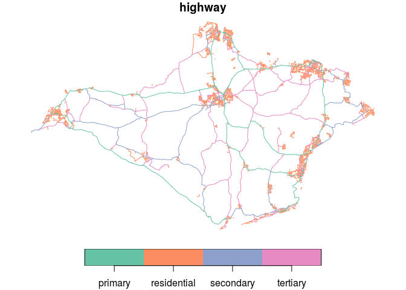
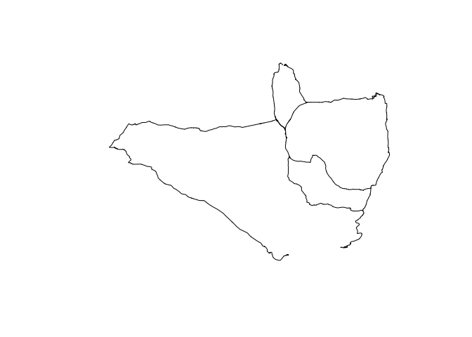

<!-- README.md is generated from README.Rmd. Please edit that file -->

<!-- README.md is generated from README.Rmd. Please edit that file -->

# osmextract

<!-- badges: start -->

[](https://github.com/itsleeds/osmextract/actions)
<!-- badges: end -->

The goal of `osmextract` is to make it easier for R users to access
freely available, community created geographic data, in the form of
OpenSteetMap data extracted by providers such as [Geofabrik
GmbH](http://download.geofabrik.de) and
[bbbike](https://download.bbbike.org/osm/). For information on
alternatives and how to add them see the [providers
vignette](https://itsleeds.github.io/osmextract/articles/providers.html).

## Why osmextract?

[`osmdata`](https://github.com/ropensci/osmdata) provides an R interface
to the [Overpass API](https://wiki.openstreetmap.org/wiki/Overpass_API),
which is ideal for downloading small OSM datasets. However, the API is
rate limited, making it hard to download large datasets. As a case
study, let’s try to download all cycleways in England:

``` r
library(osmdata)
cycleways_england = opq("England") %>% 
  add_osm_feature(key = "highway", value = "cycleway") %>% 
  osmdata_sf()
# Error in check_for_error(doc) : General overpass server error; returned:
# The data included in this document is from www.openstreetmap.org. The data is made available under ODbL. runtime error: Query timed out in "query" at line 4 after 26 seconds. 
```

The query hanged with an error message after around 10 seconds. The same
query can be made with `osmextract` as follows, which reads-in almost
100k linestrings in less than 10 seconds (after the data has been
downloaded in the compressed `.pbf` format and converted to the open
standard `.gpkg` format, not evaluated):

``` r
library(osmextract)
#> Data (c) OpenStreetMap contributors, ODbL 1.0. https://www.openstreetmap.org/copyright
#> Geofabrik data are taken from https://download.geofabrik.de/
#> For usage details of bbbike data see https://download.bbbike.org/osm/
```

``` r
cycleways_england = oe_get(
  "England",
  quiet = FALSE,
  query = "SELECT * FROM 'lines' WHERE highway = 'cycleway'"
)
plot(sf::st_geometry(cycleways_england))
```


The package is designed to complement `osmdata` which has advantages
over `osmextract` for small datasets: `osmdata` is likely to be quicker
for datasets less than \~10 MB, provides up-to-date data and has an
intuitive interface. `osmdata` can provide data in a range of formats,
while `osmextract` only returns [`sf`](https://github.com/r-spatial/sf)
objects. On the other hand, `osmextract` provides a fast way to
download large OSM datasets in the highly compressed `pbf` format and
read them in via the fast C library
[GDAL](https://gdal.org/drivers/vector/osm.html) and the R package
[`sf`](https://github.com/r-spatial/sf).

## Installation

<!-- You can install the released version of osmextract from [CRAN](https://CRAN.R-project.org) with: -->

<!-- ``` r -->

<!-- install.packages("osmextract") -->

<!-- ``` -->

You can install the development version from
[GitHub](https://github.com/) with:

``` r
# install.packages("remotes")
remotes::install_github("ITSLeeds/osmextract")
```

Load the package with:

``` r
library(sf)
#> Linking to GEOS 3.8.0, GDAL 3.0.4, PROJ 7.0.0
```

## Usage

Give `osmextract` the name of a geofabrik zone and it will download and
import it. By default it imports the ‘lines’ layer, but any layer can be
read-in. Behind the scenes, the function `read_pbf()`, a wrapper around
`sf::st_read()` is used with configuration options to import additional
columns from the `.pbf` files not imported by default, including
`maxspeed`, `lanes` and `oneway` (the attributes to include can be set
with `attributes` argument):

The package supports downloading, reading and extracting OpenStreetMap
data from various providers. A list of providers can be found at
[wiki.openstreetmap.org](https://wiki.openstreetmap.org/wiki/Processed_data_providers).
The first provider supported was
[Geofabrik](http://download.geofabrik.de/). The second was
[bbbike](https://download.bbbike.org/osm/bbbike/). The package can be
extended to support additional providers, as seen in
[code](https://github.com/ITSLeeds/osmextract/commit/be3b48e7ed7ccd957e988bacad053161247b206d)
that adds a working test provider.

Providers break the world into zones. These zones are represented as
`sf` objects that summarize the most important characteristics of each
geographic zone, such as the name and the url of the pbf file, as
illustrated in the code chunk below.

``` r
names(geofabrik_zones)
#>  [1] "id"               "name"             "parent"           "level"           
#>  [5] "iso3166_1_alpha2" "iso3166_2"        "pbf_file_size"    "pbf"             
#>  [9] "bz2"              "shp"              "pbf.internal"     "history"         
#> [13] "taginfo"          "updates"          "geometry"
st_drop_geometry(geofabrik_zones[1:3, c(2, 8)])
#>          name                                                           pbf
#> 1 Afghanistan https://download.geofabrik.de/asia/afghanistan-latest.osm.pbf
#> 2      Africa           https://download.geofabrik.de/africa-latest.osm.pbf
#> 3     Albania   https://download.geofabrik.de/europe/albania-latest.osm.pbf
bbbike_zones$name[1:20]
#>  [1] "Aachen"      "Aarhus"      "Adelaide"    "Albuquerque" "Alexandria" 
#>  [6] "Amsterdam"   "Antwerpen"   "Arnhem"      "Auckland"    "Augsburg"   
#> [11] "Austin"      "Baghdad"     "Baku"        "Balaton"     "Bamberg"    
#> [16] "Bangkok"     "Barcelona"   "Basel"       "Beijing"     "Beirut"
```

## Load package

``` r
library(osmextract)
```

The packages is composed by 4 main functions:

1.  `oe_match`: Match the input zone with one of the files stored by the
    OSM providers
2.  `oe_download`: Download the chosen file
3.  `oe_vectortranslate`: Convert the pbf format into gpkg
4.  `oe_read`: Read the gpkg file

The function `oe_get` is a wrapper around all of them.

# Test `oe_match`

The simplest example:

``` r
oe_match("Italy")
#> $url
#> [1] "https://download.geofabrik.de/europe/italy-latest.osm.pbf"
#> 
#> $file_size
#> [1] 1544340778
oe_match("Isle of wight")
#> $url
#> [1] "https://download.geofabrik.de/europe/great-britain/england/isle-of-wight-latest.osm.pbf"
#> 
#> $file_size
#> [1] 6877468
```

There are several situations where it could be difficult to find the
appropriate data source due to several small differences in the official
names:

``` r
oe_match("Korea")
#> Error: String distance between best match and the input place is 3, while the maximum threshold distance is equal to 1. You should increase the max_string_dist parameter, look for a closer match in the chosen provider database or consider using a different match_by variable.
oe_match("Russia")
#> Error: String distance between best match and the input place is 3, while the maximum threshold distance is equal to 1. You should increase the max_string_dist parameter, look for a closer match in the chosen provider database or consider using a different match_by variable.
```

For these reasons we implemented the possibility to look for the
appropriate area according to the [iso3166-1
alpha2](https://it.wikipedia.org/wiki/ISO_3166-1_alpha-2) code:

``` r
oe_match("KP", match_by = "iso3166_1_alpha2")
#> $url
#> [1] "https://download.geofabrik.de/asia/north-korea-latest.osm.pbf"
#> 
#> $file_size
#> [1] 33241783
oe_match("RU", match_by = "iso3166_1_alpha2")
#> $url
#> [1] "https://download.geofabrik.de/russia-latest.osm.pbf"
#> 
#> $file_size
#> [1] 2820253009
oe_match("US", match_by = "iso3166_1_alpha2")
#> $url
#> [1] "https://download.geofabrik.de/north-america/us-latest.osm.pbf"
#> 
#> $file_size
#> [1] 6982945396
```

The are a few cases where the `iso3166-1 alpha2` codes can fail because
there are no per-country extracts (e.g. Israel and Palestine)

``` r
oe_match("PS", match_by = "iso3166_1_alpha2")
#> Error: String distance between best match and the input place is 1, while the maximum threshold distance is equal to 0. You should increase the max_string_dist parameter, look for a closer match in the chosen provider database or consider using a different match_by variable.
oe_match("IL", match_by = "iso3166_1_alpha2")
#> Error: String distance between best match and the input place is 1, while the maximum threshold distance is equal to 0. You should increase the max_string_dist parameter, look for a closer match in the chosen provider database or consider using a different match_by variable.
```

For this reason we also created a function that let you explore the
matching variables according to a chosen pattern, for example:

``` r
oe_check_pattern("London")
#> [1] "Greater London"
oe_check_pattern("Russia")
#> [1] "Russian Federation"
oe_check_pattern("Korea")
#> [1] "North Korea" "South Korea"
oe_check_pattern("Yorkshire")
#> [1] "East Yorkshire with Hull" "North Yorkshire"         
#> [3] "South Yorkshire"          "West Yorkshire"
oe_check_pattern("US")
#> [1] "US Midwest"         "US Northeast"       "US Pacific"        
#> [4] "US South"           "US West"            "Georgia (US State)"
oe_check_pattern("US", match_by = "iso3166_2")
#>  [1] "US-AL" "US-AK" "US-AZ" "US-AR" "US-CA" "US-CO" "US-CT" "US-DE" "US-DC"
#> [10] "US-FL" "US-GA" "US-HI" "US-ID" "US-IL" "US-IN" "US-IA" "US-KS" "US-KY"
#> [19] "US-LA" "US-ME" "US-MD" "US-MA" "US-MI" "US-MN" "US-MS" "US-MO" "US-MT"
#> [28] "US-NE" "US-NV" "US-NH" "US-NJ" "US-NM" "US-NY" "US-NC" "US-ND" "US-OH"
#> [37] "US-OK" "US-OR" "US-PA" "US-PR" "US-RI" "US-SC" "US-SD" "US-TN" "US-TX"
#> [46] "US-UT" "US-VT" "US-VA" "US-WA" "US-WV" "US-WI" "US-WY"
oe_check_pattern("Palestine")
#> [1] "Israel and Palestine"
israel_sf = oe_check_pattern("Israel", full_row = TRUE)
```

The input `place` can be also specified using an `sfc_POINT` object with
arbitrary CRS as documented in the following example. If there are
multiple matches, the function returns the smallest area (according to
the `level` variable). I would ignore the CRS warning for the moment.

``` r
coords_milan = sf::st_point(c(1514924.21, 5034552.92)) # Duomo di Milano
st_sfc_milan = sf::st_sfc(coords_milan, crs = 3003)
oe_match(st_sfc_milan)
#> although coordinates are longitude/latitude, st_intersects assumes that they are planar
#> $url
#> [1] "https://download.geofabrik.de/europe/italy/nord-ovest-latest.osm.pbf"
#> 
#> $file_size
#> [1] 416306623
```

The input `place` can be also specified using a numeric vector of
coordinates. In that case the CRS is assumed to be 4326:

``` r
oe_match(c(9.1916, 45.4650)) # Duomo di Milano
#> although coordinates are longitude/latitude, st_intersects assumes that they are planar
#> $url
#> [1] "https://download.geofabrik.de/europe/italy/nord-ovest-latest.osm.pbf"
#> 
#> $file_size
#> [1] 416306623
oe_match(c(9.1916, 45.4650, 9.2020, 45.4781))
#> Error in oe_match.numeric(c(9.1916, 45.465, 9.202, 45.4781)): You need to provide a pair of coordinates and you passed as input a vector of length 4
# oe_match(c(9.1916, 45.4650), c(9.2020, 45.4781)) FIXME with suitable check and error
```

If there are several error matching the input place with one of the
zone, you can also try increasing the maximum allowed string distance:

``` r
oe_match("Isle Wight")
#> Error: String distance between best match and the input place is 3, while the maximum threshold distance is equal to 1. You should increase the max_string_dist parameter, look for a closer match in the chosen provider database or consider using a different match_by variable.
oe_match("Isle Wight", max_string_dist = 3)
#> $url
#> [1] "https://download.geofabrik.de/europe/great-britain/england/isle-of-wight-latest.osm.pbf"
#> 
#> $file_size
#> [1] 6877468
```

## Test `oe_download`

The simplest example:

``` r
iow_details = oe_match("Isle of Wight")
oe_download(
  file_url = iow_details$url, 
  file_size = iow_details$file_size
)
#> [1] "/home/andrea/osmext_data/geofabrik_isle-of-wight-latest.osm.pbf"
```

If you want to download your data into a specific folder once, you can
set the download directory:

``` r
Sys.setenv("OSMEXT_DOWNLOAD_DIRECTORY" = "/home/andrea/Downloads")
oe_download(
  file_url = iow$url, 
  file_size = iow$file_size
)
#> /home/andrea/Downloads/geofabrik_isle-of-wight-latest.osm.pbf
```

If you want to set a directory that will persist, you can set
`OSMEXT_DOWNLOAD_DIRECTORY=/path/for/osm/data` in your `.Renviron` file,
e.g. with:

``` r
usethis::edit_r_environ()
# Add a line containing: OSMEXT_DOWNLOAD_DIRECTORY=/path/to/save/files
```

## Importing OSM data

The function `oe_get()` downloads (if not already downloaded) and
reads-in data from OSM extract providers as an `sf` object:

``` r
iow = oe_get("Isle of Wight", stringsAsFactors = FALSE)
#> Reading layer `lines' from data source `/home/andrea/osmext_data/geofabrik_isle-of-wight-latest.gpkg' using driver `GPKG'
#> Simple feature collection with 44521 features and 9 fields
#> geometry type:  LINESTRING
#> dimension:      XY
#> bbox:           xmin: -5.401978 ymin: 43.35489 xmax: -0.175775 ymax: 50.89599
#> geographic CRS: WGS 84
class(iow)
#> [1] "sf"         "data.frame"
names(iow) # default variable names
#>  [1] "osm_id"     "name"       "highway"    "waterway"   "aerialway" 
#>  [6] "barrier"    "man_made"   "z_order"    "other_tags" "geometry"
```

Once imported, we can use all the functions for data frames in base R
and other packages. We can also use functions from the `sf` package for
spatial analysis and visualisation. Let’s plot all the major and minor
roads, for example:

``` r
iow_major_roads = iow[iow$highway %in% c("primary", "secondary"), ]
plot(iow_major_roads["highway"])
```



The same steps can be used to get other OSM datasets (note use of `quiet
= FALSE` to show additional message, examples not run):

``` r
test_malta = oe_get("Malta", quiet = FALSE)
ncol(test_malta)
test_andorra = oe_get("Andorra", extra_attributes = "ref", quiet = FALSE)
ncol(test_andorra)
```

## Queries

Some files from providers such as geofabrik are large. You may therefore
want to check the contents before importing them. To do this you can use
an SQL query that is passed to GDAL via `sf`. To check the values stored
in the highway column for our Isle of Wight example, for example, run
the following command:

``` r
oe_get(
  "Isle of Wight", 
  query = "SELECT DISTINCT highway FROM \"lines\" "
)
#> Reading layer `lines' from data source `/home/andrea/osmext_data/geofabrik_isle-of-wight-latest.gpkg' using driver `GPKG'
#> Warning: no simple feature geometries present: returning a data.frame or tbl_df
#>           highway
#> 1     residential
#> 2       secondary
#> 3        tertiary
#> 4    unclassified
#> 5         primary
#> 6         footway
#> 7         service
#> 8            <NA>
#> 9           track
#> 10      bridleway
#> 11          steps
#> 12           path
#> 13   primary_link
#> 14       cycleway
#> 15  living_street
#> 16     pedestrian
#> 17   construction
#> 18 secondary_link
#> 19  tertiary_link
#> 20       proposed
```

The values will vary. There are more types of highway in the Andorra
dataset, for example:

``` r
oe_get(
  "Andorra", 
  query = "SELECT DISTINCT highway FROM \"lines\" "
)
#> Reading layer `lines' from data source `/home/andrea/osmext_data/geofabrik_andorra-latest.gpkg' using driver `GPKG'
#> Warning: no simple feature geometries present: returning a data.frame or tbl_df
#>           highway
#> 1         primary
#> 2            <NA>
#> 3           trunk
#> 4  secondary_link
#> 5       secondary
#> 6        tertiary
#> 7     residential
#> 8         service
#> 9           steps
#> 10   unclassified
#> 11     pedestrian
#> 12        footway
#> 13          track
#> 14  living_street
#> 15           path
#> 16      bridleway
#> 17     trunk_link
#> 18   primary_link
#> 19       cycleway
#> 20  tertiary_link
#> 21        raceway
#> 22           road
```

The same `query` argument can be used to read-in only certain features,
all primary roads in Andorra for example:

``` r
# and select only one of them: 
iow_primary = oe_get(
  "Isle of Wight", 
  extra_attributes = "ref", 
  quiet = FALSE, 
  query = "SELECT * FROM 'lines' WHERE highway IN ('primary')"
)
#> Reading layer `lines' from data source `/home/andrea/osmext_data/geofabrik_isle-of-wight-latest.gpkg' using driver `GPKG'
#> Simple feature collection with 549 features and 10 fields
#> geometry type:  LINESTRING
#> dimension:      XY
#> bbox:           xmin: -1.537223 ymin: 50.58314 xmax: -1.141969 ymax: 50.75952
#> geographic CRS: WGS 84
class(iow_primary)
#> [1] "sf"         "data.frame"
plot(iow_primary$geometry)
```



This is substantially faster and less memory intensive than reading-in
the whole dataset and filtering with R.

You can use [GDAL’s SQL
syntax](https://gdal.org/user/ogr_sql_dialect.html) to get the result
you need. Let’s get all primary and secondary roads, for example:

``` r
iow_major_roads2 = oe_get(
  "Isle of Wight", 
  extra_attributes = "ref", 
  quiet = FALSE, 
  query = "SELECT * FROM 'lines' WHERE highway IN ('primary', 'secondary')"
)
#> Reading layer `lines' from data source `/home/andrea/osmext_data/geofabrik_isle-of-wight-latest.gpkg' using driver `GPKG'
#> Simple feature collection with 920 features and 10 fields
#> geometry type:  LINESTRING
#> dimension:      XY
#> bbox:           xmin: -1.565827 ymin: 50.58314 xmax: -1.083348 ymax: 50.76245
#> geographic CRS: WGS 84
plot(iow_major_roads2["highway"])
```


You can also use regex, as shown in the following command that gets
roads that are likely to be walking and cycling friendly:

``` r
iow_active_travel = oe_get(
  "Isle of Wight", 
  extra_attributes = "ref", 
  quiet = FALSE, 
  query = "SELECT * FROM 'lines' WHERE highway IN ('cycleway', 'living_street', 'residential')"
)
#> Reading layer `lines' from data source `/home/andrea/osmext_data/geofabrik_isle-of-wight-latest.gpkg' using driver `GPKG'
#> Simple feature collection with 2567 features and 10 fields
#> geometry type:  LINESTRING
#> dimension:      XY
#> bbox:           xmin: -1.549514 ymin: 50.57872 xmax: -1.072414 ymax: 50.76727
#> geographic CRS: WGS 84
plot(iow_active_travel["highway"])
```


## Other providers

At present `geofabrik` and `bbbike` providers are supported. An example
showing how to use an alternative provider is shown in the example
below.

``` r
leeds = oe_get(place = "Leeds", provider = "bbbike", quiet = FALSE)
names(leeds)
#> [1] "osm_id"     "name"       "highway"    "waterway"   "aerialway"  "barrier"    "man_made"   "z_order"    "other_tags" "geometry"  
plot(leeds$geometry)
```


## Next steps

We hope to make the user interface to the SQL syntax more user friendly.
We would love to see more providers added (see the [Add new
OpenStreetMap
providers](https://itsleeds.github.io/osmextract/articles/providers.html)
for details) and see what people can do with OSM datasets of the type
provided by this package in a reproducible and open statistical
programming environment for the greater good. Any contributions to
support this or any other improvements to the package are very welcome
via our issue tracker.

## Licence

We hope this package will provide easy access to OSM data for
reproducible research in the public interest, adhering to the condition
of the [OdBL licence](https://opendatacommons.org/licenses/odbl/) which
states that

> Any Derivative Database that You Publicly Use must be only under the
> terms of:

  - 1.  This License;

  - 2.  A later version of this License similar in spirit to this

## Other approaches

<!-- todo: add links to other packages -->

  - [osmdata](https://github.com/ropensci/osmdata) is an R package for
    importing small datasets directly from OSM servers
  - [pyrosm](https://pyrosm.readthedocs.io/en/latest/) is a Python
    package for reading .pbf files
  - [OpenStreetMapX.jl](https://github.com/pszufe/OpenStreetMapX.jl) is
    a Julia package for reading and analysing .osm files
  - [PostGIS](https://www.bostongis.com/PrinterFriendly.aspx?content_name=loading_osm_postgis)
    is an established spatial database that works well with large OSM
    datasets
  - Any others? Let us know\!

<!-- :) -->
