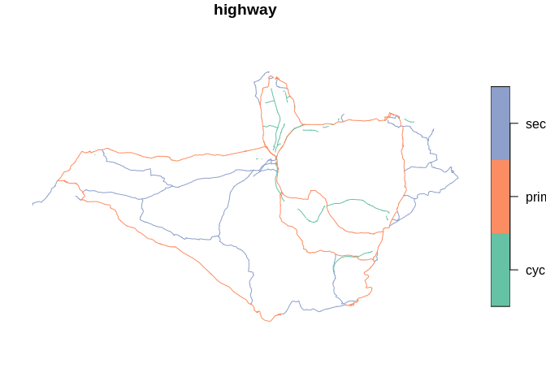
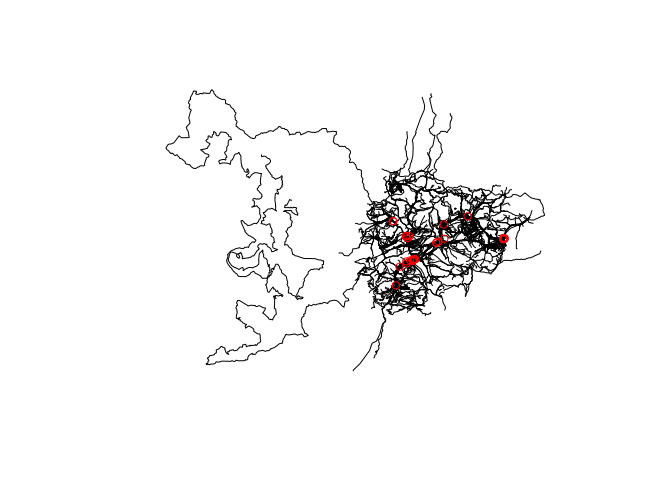
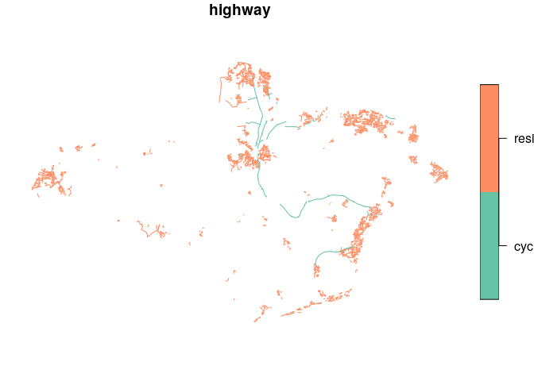
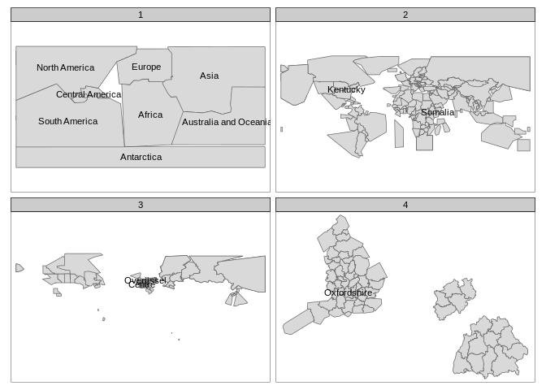

<!-- README.md is generated from README.Rmd. Please edit that file -->

# geofabrik

<!-- badges: start -->

[](https://travis-ci.org/itsleeds/geofabric)
<!-- badges: end -->

The goal of `geofabrik` is to make it easier for open source software
users to access freely available, community created geographic data, in
the form of OpenSteetMap data shipped by [Geofabrik
GmbH](http://download.geofabrik.de).

## Why geofabrik?

[`osmdata`](https://github.com/ropensci/osmdata) provides an R interface
to the [Overpass API](https://wiki.openstreetmap.org/wiki/Overpass_API),
which is ideal for downloading small OSM datasets. However, the API is
rate limited, making it hard to download large datasets. As a case
study, let’s try to download all cycleways in England:

``` r
library(osmdata)
cycleways_england = opq("England") %>% 
  add_osm_feature(key = "highway", value = "cycleway") %>% 
  osmdata_sf()
# Error in check_for_error(doc) : General overpass server error; returned:
# The data included in this document is from www.openstreetmap.org. The data is made available under ODbL. runtime error: Query timed out in "query" at line 4 after 26 seconds. 
```

The query hanged with an error message after around 10 seconds. The same
query can be made with `geofabrik` as follows (not
evaluated):

``` r
library(geofabrik)
```

``` r
cycleways_england = get_geofabrik("England", key = "highway", value = "cycleway")
plot(sf::st_geometry(cycleways_england))
```



The package is designed to complement `osmdata` which has advantages
over `geofabrik` for small datasets: it’s likely to be quicker for
datasets less than ~10 MB, provides up-to-date data and has an intuitive
interface. `osmdata` can provide data in a range of formats, while
`geofabrik` only returns [`sf`](https://github.com/r-spatial/sf)
objects.

## Installation

<!-- You can install the released version of geofabrik from [CRAN](https://CRAN.R-project.org) with: -->

<!-- ``` r -->

<!-- install.packages("geofabrik") -->

<!-- ``` -->

You can install the development version from
[GitHub](https://github.com/) with:

``` r
# install.packages("devtools")
devtools::install_github("ITSLeeds/geofabrik")
```

## Usage

Give `geofabrik` the name of a geofabrik zone and it will download and
import it. By default it imports the ‘lines’ layer, but any layer can be
read-in. Behind the scenes, the function `read_pbf()`, a wrapper around
`sf::st_read()` is used with configuration options to import additional
columns from the `.pbf` files not imported by default, including
`maxspeed`, `lanes` and `oneway` (the attributes to include can be set
with `attributes` argument):

``` r
andorra_lines = get_geofabrik(name = "andorra", layer = "lines")
#> Data already detected in ~/hd/data/osm/Andorra.osm.pbf
#> Old attributes: attributes=name,highway,waterway,aerialway,barrier,man_made
#> New attributes: attributes=name,highway,waterway,aerialway,barrier,man_made,maxspeed,oneway,building,surface,landuse,natural,start_date,wall,service,lanes,layer,tracktype,bridge,foot,bicycle,lit,railway,footway
#> Using ini file that can can be edited with file.edit(/tmp/Rtmp2996OA/ini_new.ini)
names(andorra_lines)
#>  [1] "osm_id"         "name"           "highway"        "waterway"      
#>  [5] "aerialway"      "barrier"        "man_made"       "maxspeed"      
#>  [9] "oneway"         "building"       "surface"        "landuse"       
#> [13] "natural"        "start_date"     "wall"           "service"       
#> [17] "lanes"          "layer"          "tracktype"      "bridge"        
#> [21] "foot"           "bicycle"        "lit"            "railway"       
#> [25] "footway"        "z_order"        "other_tags"     "_ogr_geometry_"
andorra_point = get_geofabrik(name = "andorra", layer = "points", attributes = "shop")
#> Data already detected in ~/hd/data/osm/Andorra.osm.pbf
#> Old attributes: attributes=name,barrier,highway,ref,address,is_in,place,man_made
#> New attributes: attributes=name,barrier,highway,ref,address,is_in,place,man_made,shop
#> Using ini file that can can be edited with file.edit(/tmp/Rtmp2996OA/ini_new.ini)
names(andorra_point) # note the 'shop' column has been added
#>  [1] "osm_id"         "name"           "barrier"        "highway"       
#>  [5] "ref"            "address"        "is_in"          "place"         
#>  [9] "man_made"       "shop"           "other_tags"     "_ogr_geometry_"
plot(sf::st_geometry(andorra_lines))
plot(andorra_point[andorra_point$shop == "supermarket", ], col = "red", add = TRUE)
#> Warning in plot.sf(andorra_point[andorra_point$shop == "supermarket", ], :
#> ignoring all but the first attribute
```



The above code plotted lines representing roads and other linear
features in Andorra, with an overlay of shops that are represented in
OSM data. If there are no files available for a zone name, `geofabrik`
will search for and import the nearest matching zone:

``` r
iow_lines = get_geofabrik(name = "isle wight")
#> Data already detected in ~/hd/data/osm/Isle of Wight.osm.pbf
#> Old attributes: attributes=name,highway,waterway,aerialway,barrier,man_made
#> New attributes: attributes=name,highway,waterway,aerialway,barrier,man_made,maxspeed,oneway,building,surface,landuse,natural,start_date,wall,service,lanes,layer,tracktype,bridge,foot,bicycle,lit,railway,footway
#> Using ini file that can can be edited with file.edit(/tmp/Rtmp2996OA/ini_new.ini)
```

Take care: files downloaded from
[geofabrik.de](http://download.geofabrik.de) can be large. You can find
information on the geofabrik region defining the boundaries of the
result with `gf_find()`:

``` r
iow_gf_region = gf_find("isle wight")
plot(iow_gf_region)
#> Warning: plotting the first 9 out of 11 attributes; use max.plot = 11 to plot
#> all
```


``` r
iow_gf_name = iow_gf_region$name
iow_gf_name
#> [1] "Isle of Wight"
```

If you want to use `st_read()` to read-in the `.pbf` files, e.g. to set
additional query arguments, you can do so, as demonstrated below.

``` r
iow_gf_file = gf_filename(iow_gf_name)
iow_gf_file
#> [1] "~/hd/data/osm/Isle of Wight.osm.pbf"
file.exists(iow_gf_file)
#> [1] TRUE
iow_lines_cycle = read_pbf(dsn = iow_gf_file, "lines", key = "highway", value = "cycleway")
#> Old attributes: attributes=name,highway,waterway,aerialway,barrier,man_made
#> New attributes: attributes=name,highway,waterway,aerialway,barrier,man_made,maxspeed,oneway,building,surface,landuse,natural,start_date,wall,service,lanes,layer,tracktype,bridge,foot,bicycle,lit,railway,footway
#> Using ini file that can can be edited with file.edit(/tmp/Rtmp2996OA/ini_new.ini)
plot(iow_lines_cycle)
#> Warning: plotting the first 9 out of 27 attributes; use max.plot = 27 to plot
#> all
```



If you want even more control, you can used GDAL’s `query` argument via
`sf`:

``` r
query = paste0("select highway from lines where highway = ",
               "'cycleway' or highway = 'secondary' or highway = 'primary'")
iow_lines_subset = sf::st_read(iow_gf_file, layer = "lines", query = query)
#> Reading layer `lines' from data source `/mnt/57982e2a-2874-4246-a6fe-115c199bc6bd/data/osm/Isle of Wight.osm.pbf' using driver `OSM'
#> Simple feature collection with 1057 features and 1 field
#> geometry type:  LINESTRING
#> dimension:      XY
#> bbox:           xmin: -1.565827 ymin: 50.58314 xmax: -1.083348 ymax: 50.76245
#> epsg (SRID):    4326
#> proj4string:    +proj=longlat +datum=WGS84 +no_defs
plot(iow_lines_subset)
```


<!-- TODO: FIX THE FOLLOWING PART SINCE IT DOESN'T WORK -->

<!-- You can also get your geofabrik data based on a spatial query, for example in Honduras: -->

<!-- ```{r} -->

<!-- library(geofabrik) -->

<!-- place_sf = sf::st_as_sf(data.frame(x = -86, y = 15, n = 1), -->

<!--                         coords = c("x", "y"), crs = 4326) -->

<!-- osm_data_place = get_geofabrik(place_sf) -->

<!-- plot(osm_data_place["highway"]) -->

<!-- ``` -->

# geofabrik zones

The package ships with a data frame representing all zones made
available by the package. These can be interactively searched with the
following command:

``` r
View(sf::st_drop_geometry(geofabrik_zones[1:3]))
```

That will display the following table in the
viewer:

| name                  | size\_pbf | pbf\_url                                                        |
| :-------------------- | :-------- | :-------------------------------------------------------------- |
| Africa                | (3.5 GB)  | <http://download.geofabrik.de/africa-latest.osm.pbf>            |
| Antarctica            | (29.0 MB) | <http://download.geofabrik.de/antarctica-latest.osm.pbf>        |
| Asia                  | (7.6 GB)  | <http://download.geofabrik.de/asia-latest.osm.pbf>              |
| Australia and Oceania | (727 MB)  | <http://download.geofabrik.de/australia-oceania-latest.osm.pbf> |

The following attributes are available from this file if you want more
info about each geofabrik zone:

``` r
names(geofabrik_zones)
#>  [1] "name"         "size_pbf"     "pbf_url"      "page_url"     "part_of"     
#>  [6] "continent"    "country"      "region"       "subregion"    "level"       
#> [11] "geometry_url" "geometry"
```

Each geographic level (continents, countries, regions and subregions) is
shown in the map below, with a few of them named for reference.

``` r
# todo: tidy up geofabrik_zones data and this code chunk
library(tmap)
sel1 = is.na(geofabrik_zones$level)
geofabrik_zones$level[sel1] = 1
geofabrik_zones$label = ""
geofabrik_zones$label[sel1] = geofabrik_zones$name[sel1]
set.seed(9)
sel2 = sample(x = 1:nrow(geofabrik_zones), size = 5)
geofabrik_zones$label[sel2] = geofabrik_zones$name[sel2]
tm_shape(geofabrik_zones) +
  tm_polygons() +
  tm_text(text = "label") +
  tm_facets(by = "level")
#> Warning: The shape geofabrik_zones is invalid. See sf::st_is_valid
#> Linking to GEOS 3.8.0, GDAL 3.0.2, PROJ 6.2.1
```



A couple of the countries, regions and sub regions available is shown
below.

``` r
geofabrik_countries = geofabrik_zones[geofabrik_zones$level == 2, ]
knitr::kable(sf::st_drop_geometry(geofabrik_countries[1:2, 1:3]))
```

|    | name    | size\_pbf | pbf\_url                                                     |
| -- | :------ | :-------- | :----------------------------------------------------------- |
| 9  | Algeria | (85 MB)   | <http://download.geofabrik.de/africa/algeria-latest.osm.pbf> |
| 10 | Angola  | (46.6 MB) | <http://download.geofabrik.de/africa/angola-latest.osm.pbf>  |

``` r
geofabrik_regions = geofabrik_zones[geofabrik_zones$level == 3, ]
knitr::kable(sf::st_drop_geometry(geofabrik_regions[1:2, 1:3]))
```

|     | name           | size\_pbf | pbf\_url                                                         |
| --- | :------------- | :-------- | :--------------------------------------------------------------- |
| 238 | Chūbu region   | (289 MB)  | <http://download.geofabrik.de/asia/japan/chubu-latest.osm.pbf>   |
| 239 | Chūgoku region | (130 MB)  | <http://download.geofabrik.de/asia/japan/chugoku-latest.osm.pbf> |

``` r
geofabrik_subregions = geofabrik_zones[geofabrik_zones$level == 4, ]
knitr::kable(sf::st_drop_geometry(geofabrik_subregions[1:2, 1:3]))
```

|     | name                       | size\_pbf | pbf\_url                                                                                         |
| --- | :------------------------- | :-------- | :----------------------------------------------------------------------------------------------- |
| 365 | Regierungsbezirk Freiburg  | (113 MB)  | <http://download.geofabrik.de/europe/germany/baden-wuerttemberg/freiburg-regbez-latest.osm.pbf>  |
| 366 | Regierungsbezirk Karlsruhe | (105 MB)  | <http://download.geofabrik.de/europe/germany/baden-wuerttemberg/karlsruhe-regbez-latest.osm.pbf> |
