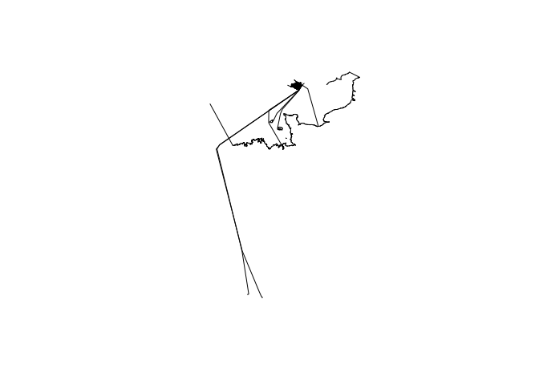

<!-- README.md is generated from README.Rmd. Please edit that file -->

# geofabric

<!-- badges: start -->

<!-- badges: end -->

The goal of geofabric is to make it easier for open source software
users to access freely available, community created geographic data, in
the form of OpenSteetMap data shipped by [Geofabrik
GmbH](http://download.geofabrik.de).

## Installation

<!-- You can install the released version of geofabric from [CRAN](https://CRAN.R-project.org) with: -->

<!-- ``` r -->

<!-- install.packages("geofabric") -->

<!-- ``` -->

You can install the development version from
[GitHub](https://github.com/) with:

``` r
# install.packages("devtools")
devtools::install_github("ITSLeeds/geofabric")
```

## Usage

Give geofabric the name of a geofabric zone and it will download and
import it. By default it imports the ‘lines’ layer, but any layer can be
read-in.

``` r
library(geofabric)
andorra_lines = get_geofabric(name = "andorra", layer = "lines")
#> No exact matching geofabric zone. Best match is Andorra
#> Downloading http://download.geofabrik.de/europe/andorra-latest.osm.pbf to /tmp/Rtmpdr8qaM/andorra.osm.pbf
andorra_point = get_geofabric(name = "andorra", layer = "points")
#> No exact matching geofabric zone. Best match is Andorra
#> Data already detected in /tmp/Rtmpdr8qaM/andorra.osm.pbf
plot(andorra_lines$geometry)
plot(andorra_point, add = TRUE)
#> Warning in plot.sf(andorra_point, add = TRUE): ignoring all but the first
#> attribute
```


If there are no files available for a zone name, geofabric will search
for and import the nearest matching zone:

``` r
iow_lines = get_geofabric(name = "isle wight")
#> No exact matching geofabric zone. Best match is Isle of Wight
#> Downloading http://download.geofabrik.de/europe/great-britain/england/isle-of-wight-latest.osm.pbf to /tmp/Rtmpdr8qaM/isle wight.osm.pbf
plot(iow_lines$geometry) # note the lines contain ferry services to france and elsewhere
```



Take care: files downloaded from geofabrik can be large.

# geofabrik zones

The package ships with a data frame representing all zones made
available by the package. These can be interactively searched with the
following command:

``` r
View(sf::st_drop_geometry(geofabric_zones[1:3]))
```

That will display the following table in the
viewer:

| name                  | size\_pbf | pbf\_url                                                        |
| :-------------------- | :-------- | :-------------------------------------------------------------- |
| Africa                | (3.2 GB)  | <http://download.geofabrik.de/africa-latest.osm.pbf>            |
| Antarctica            | (29.0 MB) | <http://download.geofabrik.de/antarctica-latest.osm.pbf>        |
| Asia                  | (7.3 GB)  | <http://download.geofabrik.de/asia-latest.osm.pbf>              |
| Australia and Oceania | (684 MB)  | <http://download.geofabrik.de/australia-oceania-latest.osm.pbf> |

The following attributes are available from this file if you want more
info about each geofabric zone:

``` r
names(geofabric_zones)
#>  [1] "name"         "size_pbf"     "pbf_url"      "page_url"    
#>  [5] "part_of"      "level"        "continent"    "country"     
#>  [9] "region"       "subregion"    "geometry_url" "geometry"
```

Each geographic level (continents, countries, regions and subregions) is
shown in the map below, with a few of them named for reference.

    #> Linking to GEOS 3.5.1, GDAL 2.1.2, PROJ 4.9.3


A couple of the countries, regions and sub regions available is shown
below.

``` r
geofabric_countries = geofabric_zones[geofabric_zones$level == 2, ]
knitr::kable(sf::st_drop_geometry(geofabric_countries[1:2, 1:3]))
```

|    | name    | size\_pbf    | pbf\_url                                                     |
| -- | :------ | :----------- | :----------------------------------------------------------- |
| 9  | Algeria | \[.osm.bz2\] | <http://download.geofabrik.de/africa/algeria-latest.osm.pbf> |
| 10 | Angola  | \[.osm.bz2\] | <http://download.geofabrik.de/africa/angola-latest.osm.pbf>  |

``` r
geofabric_regions = geofabric_zones[geofabric_zones$level == 3, ]
knitr::kable(sf::st_drop_geometry(geofabric_regions[1:2, 1:3]))
```

|     | name           | size\_pbf | pbf\_url                                                         |
| --- | :------------- | :-------- | :--------------------------------------------------------------- |
| 238 | Chūbu region   | (276 MB)  | <http://download.geofabrik.de/asia/japan/chubu-latest.osm.pbf>   |
| 239 | Chūgoku region | (128 MB)  | <http://download.geofabrik.de/asia/japan/chugoku-latest.osm.pbf> |

``` r
geofabric_subregions = geofabric_zones[geofabric_zones$level == 4, ]
knitr::kable(sf::st_drop_geometry(geofabric_subregions[1:2, 1:3]))
```

|     | name                       | size\_pbf | pbf\_url                                                                                         |
| --- | :------------------------- | :-------- | :----------------------------------------------------------------------------------------------- |
| 360 | Regierungsbezirk Freiburg  | (111 MB)  | <http://download.geofabrik.de/europe/germany/baden-wuerttemberg/freiburg-regbez-latest.osm.pbf>  |
| 361 | Regierungsbezirk Karlsruhe | (104 MB)  | <http://download.geofabrik.de/europe/germany/baden-wuerttemberg/karlsruhe-regbez-latest.osm.pbf> |
