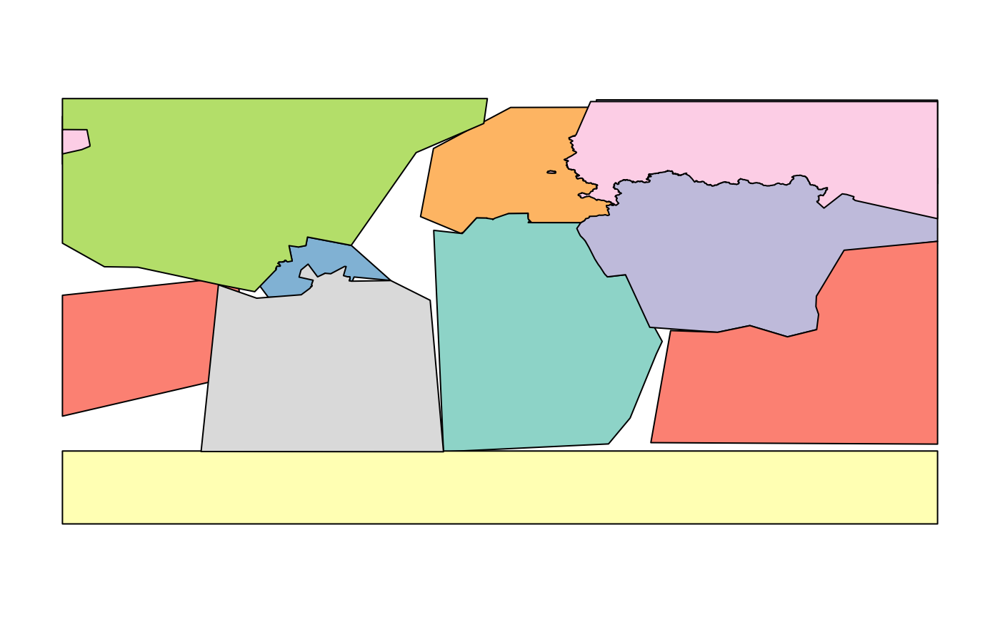
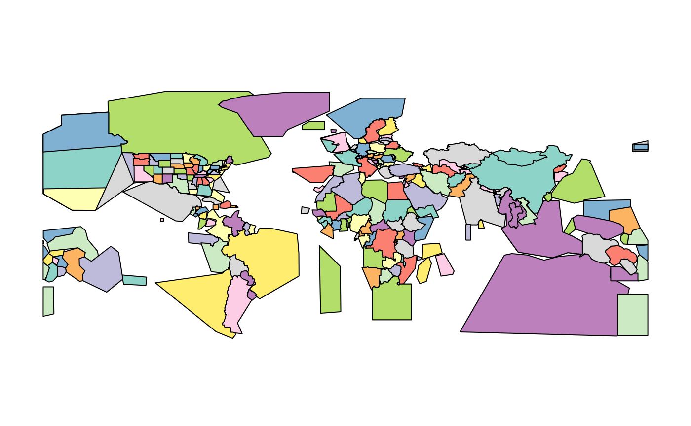
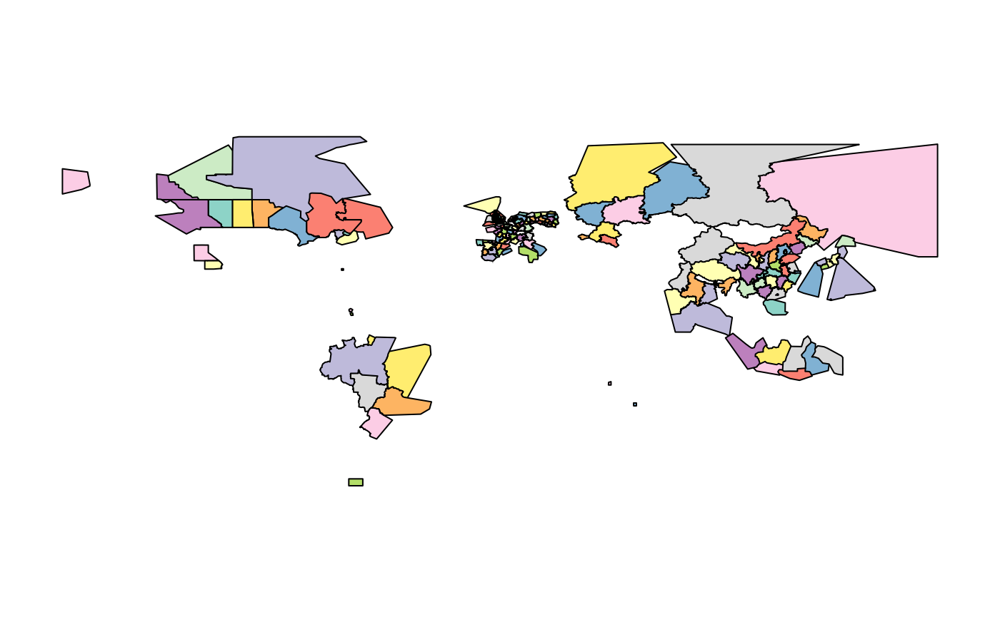
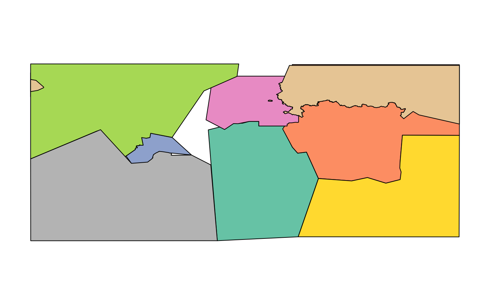
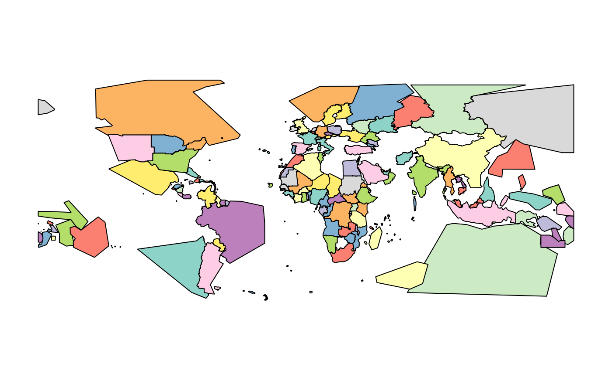
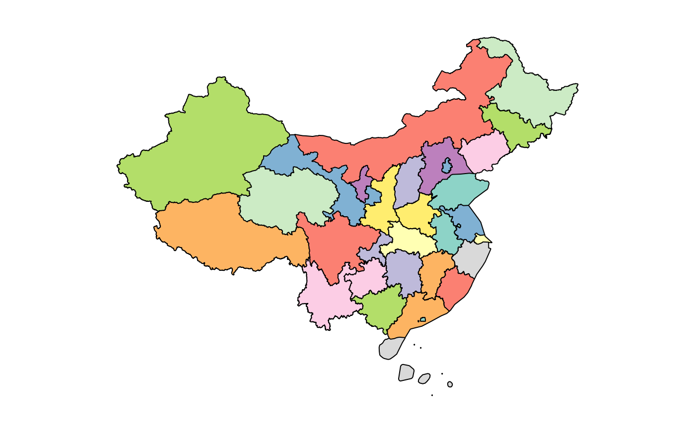
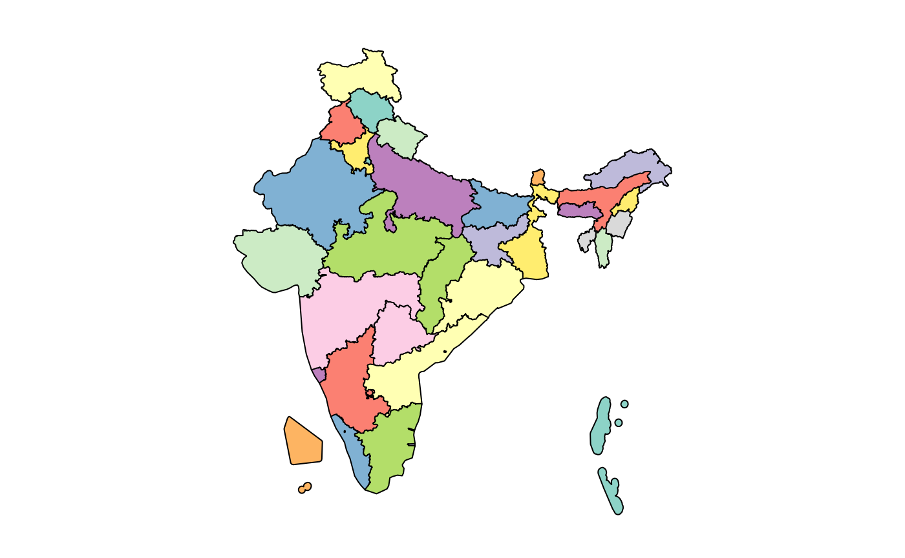
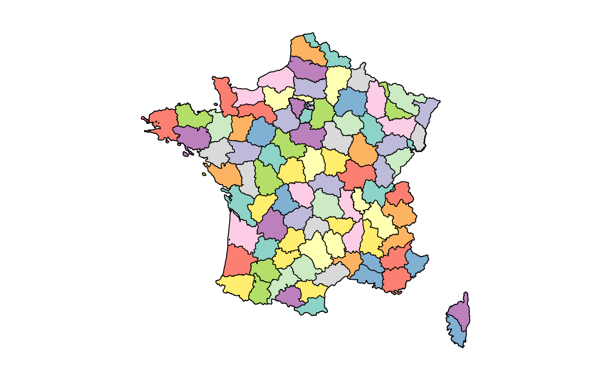
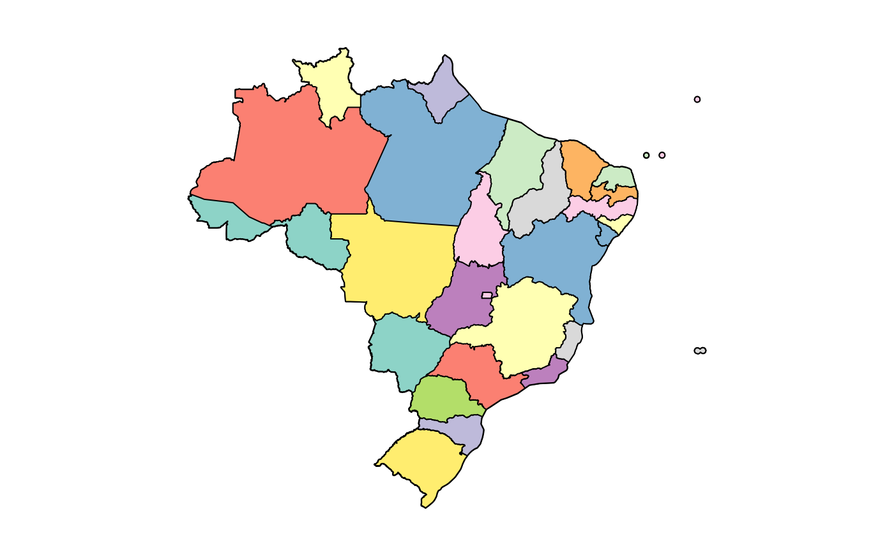
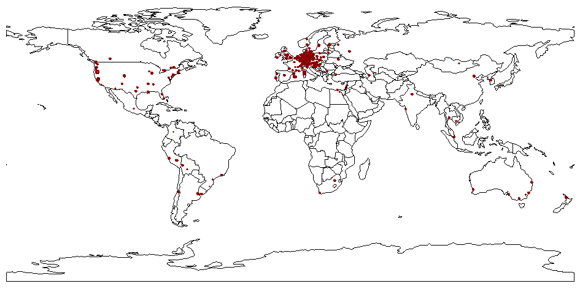

# Comparing the supported OSM providers

This vignette presents a simple comparison between the OSM providers
supported by `osmextract`, explaining their pros and cons. We decided to
write this vignette since, as you will see in the following examples,
even if you always start from the same pre-defined `place`, you can get
significantly different OSM extracts according to the chosen `provider`.
Hence, we want to help you choose the best suitable provider for a given
situation.

We assume that you are already familiar with the basic functions in
`osmextract`, otherwise please check the “Get Started” vignette for a
more detailed introduction. Now, let’s start with an example, but, first
of all, we have to load the package:

``` r

library(osmextract)
#> Data (c) OpenStreetMap contributors, ODbL 1.0. https://www.openstreetmap.org/copyright.
#> Check the package website, https://docs.ropensci.org/osmextract/, for more details.
library(sf)
#> Linking to GEOS 3.12.1, GDAL 3.8.4, PROJ 9.4.0; sf_use_s2() is TRUE
```

We geocode the coordinates of Lima, the Capital of Peru,

``` r

lima = tmaptools::geocode_OSM("Lima, Peru")$coords
```

and look for a match in the OSM extracts using
[`oe_match()`](https://docs.ropensci.org/osmextract/reference/oe_match.md):

``` r

oe_match(lima, provider = "geofabrik")
#> $url
#> [1] "https://download.geofabrik.de/south-america/peru-latest.osm.pbf"
#> 
#> $file_size
#> [1] 2.28e+08
oe_match(lima, provider = "bbbike")
#> $url
#> [1] "https://download.bbbike.org/osm/bbbike/Lima/Lima.osm.pbf"
#> 
#> $file_size
#> [1] 29546437
oe_match(lima, provider = "openstreetmap_fr")
#> $url
#> [1] "http://download.openstreetmap.fr/extracts/south-america-latest.osm.pbf"
#> 
#> $file_size
#> [1] 4379408462
```

We can see that:

- when we used `geofabrik` provider (which is also the default
  provider), then the input `place` was matched with an OSM extract
  corresponding to Peru region;
- when we used the `bbbike` provider, then the input `place` was matched
  with an OSM extract corresponding to the city of Lima;
- when we used `openstreetmap_fr` provider, then the input data was
  matched with an OSM extract covering the whole of South America.

The reason behind these differences is that each OSM provider divides
the geographical space into different discrete chunks, and, in the
following paragraphs, we will show the tessellation used by each
provider.

## Geofabrik

`geofabrik` is a society that provides map-based services and free
downloads of OSM extracts that are updated daily. These extracts are
based on a division of the world into different regions, covering a
whole continent (plus Russian Federation):

``` r

par(mar = rep(0, 4))
plot(geofabrik_zones[geofabrik_zones$level == 1, "name"], key.pos = NULL, main = NULL)
```



or several countries all around the world:

``` r

plot(geofabrik_zones[geofabrik_zones$level == 2, "name"], key.pos = NULL, main = NULL)
```



Geofabrik also defines several special zones, such as Alps, Britain and
Ireland, Germany, Austria and Switzerland, US Midwest, US Northeast, US
Pacific, US South and US West. Moreover, it contains extracts relative
to some administrative subregions, mainly in Europe, Russia, Canada and
South America:

``` r

plot(geofabrik_zones[geofabrik_zones$level == 3, "name"], key.pos = NULL, main = NULL)
```



Check
[`?geofabrik_zones`](https://docs.ropensci.org/osmextract/reference/geofabrik_zones.md)
and the [provider’s webpage](http://download.geofabrik.de/) for more
details.

## Openstreetmap.fr

`openstreetmap_fr` extracts are taken from
<http://download.openstreetmap.fr/>, a web-service that provides OSM
data updated every few minutes. The extracts are based on several
regions, such as the continents:

``` r

# Russian federation is considered as a level 1 zone
plot(openstreetmap_fr_zones[openstreetmap_fr_zones$level == 1, "name"], key.pos = NULL, main = NULL)
```



or some countries around the world (less than `geofabrik`):

``` r

plot(openstreetmap_fr_zones[openstreetmap_fr_zones$level == 2, "name"], key.pos = NULL, main = NULL)
```



It can be noticed that there are several holes (such as Peru, which is
the reason why, in the first example, Lima was matched with South
America data), implying that `openstreetmap_fr` cannot always be used
for geographical matching of a `place`. Nevertheless, it provides
extremely detailed extracts for some regions of the world, like China,

``` r

plot(openstreetmap_fr_zones[openstreetmap_fr_zones$parent == "china", "name"], key.pos = NULL, main = NULL)
```



India,

``` r

plot(openstreetmap_fr_zones[openstreetmap_fr_zones$parent == "india", "name"], key.pos = NULL, main = NULL)
```



France,

``` r

ids_2 = openstreetmap_fr_zones$parent %in% "france"
ids_3 = openstreetmap_fr_zones$parent %in% openstreetmap_fr_zones$id[ids_2]

plot(openstreetmap_fr_zones[ids_2 | ids_3, "name"], key.pos = NULL, main = NULL)
```



and Brazil

``` r

ids_2 = openstreetmap_fr_zones$parent %in% "brazil"
ids_3 = openstreetmap_fr_zones$parent %in% openstreetmap_fr_zones$id[ids_2]

plot(openstreetmap_fr_zones[ids_2 | ids_3, "name"], key.pos = NULL, main = NULL)
```



## BBBike

`bbbike` provider is based on <https://download.bbbike.org/osm/bbbike/>.
It is quite different from any other provider supported in `osmextract`
since it contains OSM data for more than 200 cities worldwide.

``` r

par(mar = rep(0, 4))
plot(sf::st_geometry(spData::world))
plot(sf::st_geometry(bbbike_zones), border = "darkred", add = TRUE, lwd = 3)
```



`bbbike` provider is the safest choice if you are looking for OSM data
relative to a particular city in the world.
