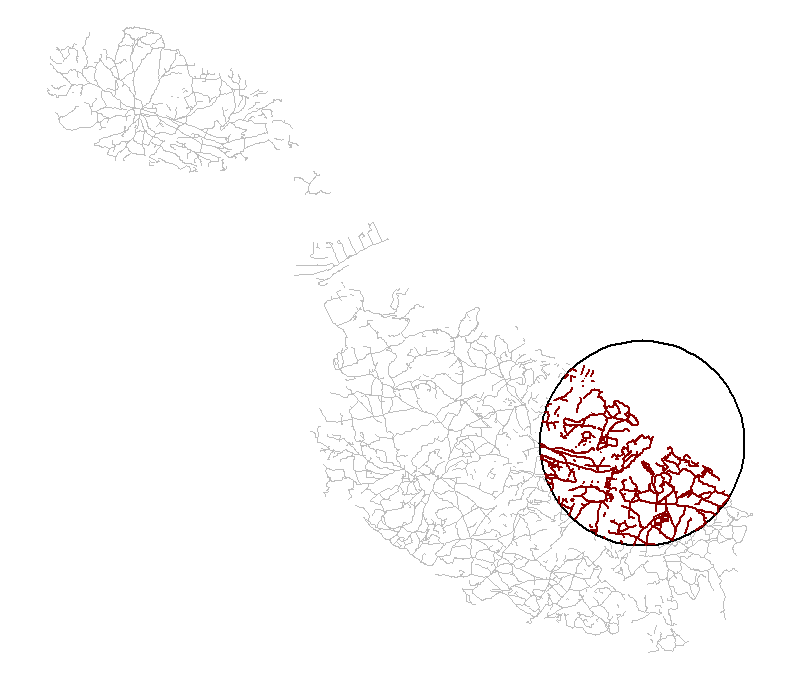
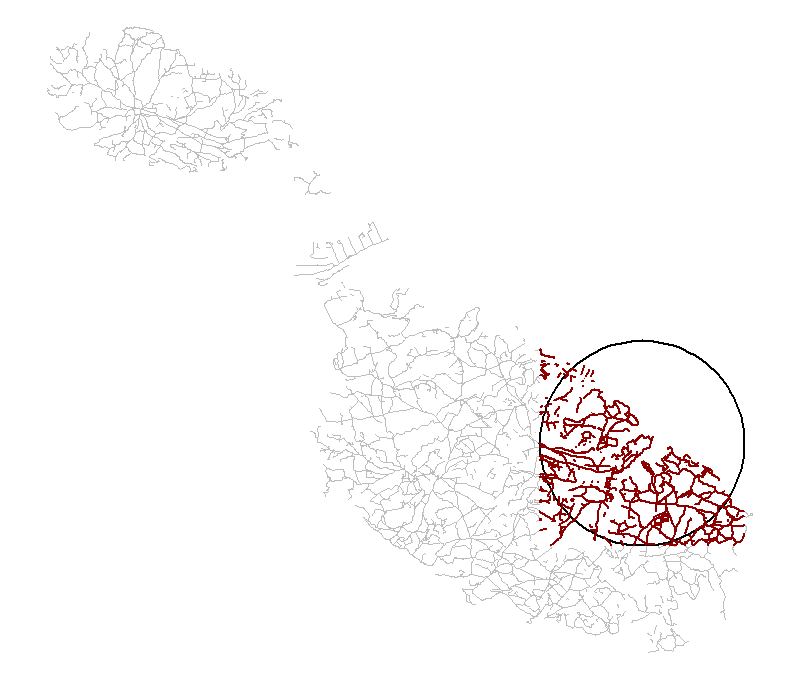

```{r setup, include = FALSE}
knitr::opts_chunk$set(
  collapse = TRUE,
  comment = "#>", 
  fig.align = "center"
)

# save user's options and pars
user_options = options()
user_par = par(no.readonly = TRUE)

# save files in the tempdir
old_dd = Sys.getenv("OSMEXT_DOWNLOAD_DIRECTORY", tempdir())
Sys.setenv(OSMEXT_DOWNLOAD_DIRECTORY = tempdir())

# set new options
options(width = 100)
```

This vignette provides an introduction to using the package, building on the README which covers installation and our motivations for creating it.

Loading the package generates important messages about the license associated with OSM data.

```{r}
library(osmextract)
```

The first thing to say is: **do not ignore this message**!
The Open Street Map (OSM) extracts are stored by external providers such as [Geofabrik](https://download.geofabrik.de/), [Bbbike](https://download.bbbike.org/osm/), or [OpenStreetMap.fr](http://download.openstreetmap.fr/). 
There are important legal considerations that you should be aware of before using OSM data, especially if you are working in a for-profit capacity.

# Legal considerations

Anyone using OSM data is bound by law to adhere to the [ODbL](https://opendatacommons.org/licenses/odbl/summary/), which means that you must:

- **Attribute**: You must attribute any public use of the database, or works produced from the database, in the manner specified in the ODbL. For any use or redistribution of the database, or works produced from it, you must make clear to others the license of the database and keep intact any notices on the original database.
- **Share-Alike**: If you publicly use any adapted version of this database, or works produced from an adapted database, you must also offer that adapted database under the ODbL.
- **Keep open**: If you redistribute the database or an adapted version of it, then you may use technological measures that restrict the work (such as DRM) as long as you also redistribute a version without such measures.

In short, publicly using OSM data without attribution or selling datasets derived from it is illegal.
See the [License/Use Cases page on the OSM wiki](https://wiki.openstreetmap.org/wiki/License/Use_Cases) for detailed use cases.

# Main package functions

The package is composed of the following main functions: 

1. `oe_providers()`: Show which OSM providers are available;
1. `oe_match()`: Match an input place with one of the files stored by the OSM providers;
1. `oe_download()`: Download the chosen file;
1. `oe_vectortranslate()`: Convert between `.pbf` and `.gpkg` formats;
1. `oe_read()`: Read `.pbf` and `.gpkg` files;
1. `oe_get()`: Match, download, (vector)translate, and import data, all in one step.

For many users who just want to get OSM data quickly, `oe_get()` may be sufficient, as covered in the README.
We will demonstrate each function in turn, following the same order in which they are typically used. 
As you can see, the name of the most important functions in this package start with `oe_*` prefix, which means that you can easily use auto-completion features (with Rstudio or similar IDE(s)). 

## `oe_providers()`: List providers

`oe_providers()` lists the providers that are currently available with the version of `osmextract` you have installed.

```{r}
oe_providers()
```

Each element in the column `database_name` is a data object that is packaged with `osmextract`. 
You can read a detailed description of each provider data running, for example, `?geofabrik_zones` or `?bbbike_zones`. 

Perhaps, the best known bulk OSM data provider is [Geofabrik](https://www.geofabrik.de/), and its extracts are summarised as a `data.frame` in the packaged object `geofabrik_zones`.

```{r}
class(geofabrik_zones)
```

Note that in addition to being a data frame with rows and columns, `geofabrik_zones` is also an `sf` object, as defined in the [package](https://r-spatial.github.io/sf/) of the same name.
When working with `sf` objects, it makes sense to have the package loaded:

```{r}
library(sf)
```

That gives you access to many functions for working with geographic vector data of the type provided by `osmextract`.
Each row of data in an `sf` object contains a geometry, representing the area covered by a provider zone, meaning you can plot the data as follows:

```{r}
par(mar = rep(0.1, 4))
plot(st_geometry(geofabrik_zones))
```

The plot above shows how the provider divides geographic space into discrete chunks.
Different providers have other zoning systems. 
For example: 

```{r, eval = FALSE}
par(mar = rep(0.1, 4))
plot(st_geometry(spData::world), xlim = c(-2, 10), ylim = c(35, 60))
plot(st_geometry(bbbike_zones), xlim = c(-2, 10), ylim = c(35, 60), col = "darkred", add = TRUE)
```

```{r, echo = FALSE, out.width="80%"}
knitr::include_graphics(
  path = "../man/figures/94461461-772e4d00-01ba-11eb-950c-804ad177729f.png"
)
```

As shown in the visualisation above of [BBBike.org](https://download.bbbike.org/osm/) zones in Europe, that provider offers rectangular extracts of the major cities.
We are working on adding support for manually selected regions from the BBBike website (see https://github.com/ropensci/osmextract/issues/100).

Check the ["Comparing the supported OSM providers"](https://docs.ropensci.org/osmextract/articles/providers_comparisons.html) vignette for some simple guidelines on how to choose the best provider. 

## `oe_match()`: Match an input place with an OSM extract

The function `oe_match()` takes in input a string through the parameter `place`, and it returns a named list of length two with the URL and the size (in bytes) of a `.osm.pbf`^[The `.pbf` format is a highly optimised binary format used by OSM providers to store and share OSM extracts.] file representing a geographical zone stored by one of the supported providers. 
For example: 

```{r}
oe_match("Italy")
oe_match("Leeds", provider = "bbbike")
```

The geographical zone is chosen by calculating the Approximate String Distance (`?adist()`) between the input `place` and one of the fields in the provider's dataset.
Then, the function selects the closest match. 
By default, `oe_match()` uses the `name` field and `Geofabrik` provider, but you can select a different field via the argument `match_by`. 
We refer to the providers' help pages for a detailed description of all available fields. 
If you are using Geofabrik provider, a useful and interesting alternative field is represented by the (unique and unambiguous) [`iso3166-1 alpha2` codes](https://it.wikipedia.org/wiki/ISO_3166-1_alpha-2): 

```{r}
oe_match("RU", match_by = "iso3166_1_alpha2")
oe_match("US", match_by = "iso3166_1_alpha2")
```

There are a few scenarios where the `iso3166-1 alpha2` codes in `geofabrik_data` cannot be used since there are no per-country extracts (e.g. Israel and Palestine):

```{r, error = TRUE}
oe_match("PS", match_by = "iso3166_1_alpha2", quiet = TRUE)
oe_match("IL", match_by = "iso3166_1_alpha2", quiet = TRUE)
```

For this reason, we coded a function named `oe_match_pattern()` to explore the matching operations for all available providers according to a pre-defined pattern. 
It returns a named list where the names are the id(s) of the supported OSM providers and the values are the matched names. 
For example:

```{r}
oe_match_pattern("London")
oe_match_pattern("Yorkshire")
oe_match_pattern("Russia")
oe_match_pattern("Palestine")
```

The default field is `name`, but we can change that as follows: 

```{r}
oe_match_pattern("US", match_by = "iso3166_2")
```

If we set `full_row = TRUE`, then `oe_match_pattern()` will return the complete row(s) from each provider's data: 

```{r}
lapply(oe_match_pattern("Israel", full_row = TRUE), function(x) x[, 1:3])
```

We can combine the two functions as follows: 

```{r}
oe_match_pattern("Valencia")
oe_match("Comunitat Valenciana", provider = "openstreetmap_fr")
```

The parameter `max_string_dist` (default value is 1) represents the maximum tolerable distance between the input place and the closest match in `match_by` column. 
This value can always be increased to help the matching operations, but that can lead to false matches:

```{r, error = TRUE}
# erroneous match
oe_match("Milan", max_string_dist = 2)
```

The parameter `max_string_dist` is always set to 0 if `match_by` argument is equal to `iso3166_1_alpha2` or `iso3166_2`. 

If the approximate string distance between the closest match and the input `place` is greater than `max_string_dist`, then `oe_match()` will also check the other supported providers. 
For example: 

```{r}
oe_match("Leeds")
oe_match("London")
oe_match("Vatican City")
```

Finally, if there is no exact match with any of the supported providers and `match_by` argument is equal to `"name"`, then `oe_match()` will use the [Nominatim API](https://nominatim.org/release-docs/develop/api/Overview/) to geolocate the input place and perform a spatial matching operation (explained below): 

```{r, eval = FALSE}
oe_match("Milan")
#> No exact match found for place = Milan and provider = geofabrik. Best match is Iran. 
#> Checking the other providers.
#> No exact match found in any OSM provider data. Searching for the location online.
#> The input place was matched with Nord-Ovest. 
#> $url
#> [1] "https://download.geofabrik.de/europe/italy/nord-ovest-latest.osm.pbf"
#> $file_size
#> [1] 416306623
```

### Finding zones based on geographic inputs

The input `place` can also be specified using an `sf`, `sfc`, or `bbox` object with arbitrary CRS^[If the input spatial object has no CRS, then `oe_match()` raises a warning message and sets `CRS = 4326`.], as documented in the following example. 
`oe_match()` will return a named list of length two with the URL and the size of a `.pbf` file representing a zone that geographically contains the `sf` or `sfc` object  (or an error if the input is not contained into any geographical area).

```{r}
milan_duomo = sf::st_sfc(sf::st_point(c(1514924, 5034552)), crs = 3003)
oe_match(milan_duomo)
```

If the input `place` intersects multiple geographically nested areas and the argument `level` is equal to `NULL` (the default value), then `oe_match()` automatically returns the extract with the highest `level`. 
In particular, we could roughly say that smaller geographical areas are associated with higher `level`(s). 
For example, `level = 1` may correspond to continent-size extracts, `2` is for countries, `3` represents the regions and `4` the subregions:

```{r, error = TRUE}
yak = c(-120.51084, 46.60156)
oe_match(yak, level = 1, quiet = TRUE)
oe_match(yak, level = 2, quiet = TRUE) # the default
oe_match(yak, level = 3, quiet = TRUE) # error
```

If there are multiple OSM extract intersecting the input `place` at the same `level`, then `oe_match()` will return the area whose centroid is closest to the input `place`.

If you specify more than one geometry into the `sf` or `sfc` object, then `oe_match()` will select an area that contains all of them. 

```{r}
milan_leeds = st_sfc(
  st_point(c(9.190544, 45.46416)), # Milan
  st_point(c(-1.543789, 53.7974)), # Leeds
  crs = 4326
)
oe_match(milan_leeds)
```

The same operations work with `LINESTRING` or `POLYGON` objects: 

```{r}
milan_leeds_linestring = st_sfc(
  st_linestring(
    rbind(c(9.190544, 45.46416), c(-1.543789, 53.7974))
  ), 
  crs = 4326
)
oe_match(milan_leeds_linestring)
```

The input `place` can also be specified using a numeric vector of coordinates. 
In that case, the CRS is assumed to be [EPSG:4326](https://spatialreference.org/ref/epsg/4326/):

```{r}
oe_match(c(9.1916, 45.4650)) # Duomo di Milano using EPSG: 4326
```

Finally, to reduce unnecessary computational resources and save bandwidth/electricity, we will use a small OSM extract in subsequent sections that can be matched as follows:

```{r}
# ITS stands for Institute for Transport Studies: https://environment.leeds.ac.uk/transport
(its_details = oe_match("ITS Leeds"))
```

## `oe_download()`: Download OSM extracts 

The `oe_download()` function is used to download `.pbf` files representing OSM extracts.
It takes in input a URL, through the parameter `file_url`, and it downloads the requested data in a directory (specified by the parameter `download_directory`):

```{r, eval = FALSE}
oe_download(
  file_url = its_details$url, 
  file_size = its_details$file_size,
  provider = "test",
  download_directory = # path-to-a-directory
)
```

The argument `provider` can be omitted if the input `file_url` is associated with one of the supported providers.
The default value for `download_directory` is `tempdir()` (see `?tempdir`), but, if you want to point to a directory that will persist, you can add `OSMEXT_DOWNLOAD_DIRECTORY=/path/for/osm/data` in your `.Renviron` file, e.g. with:

```{r, eval = FALSE}
usethis::edit_r_environ()
# Add a line containing: OSMEXT_DOWNLOAD_DIRECTORY=/path/for/osm/data
```

You can always check the default `download_directory` used by `oe_download()` with: 

```{r}
oe_download_directory()
```

We strongly advise you setting a persistent directory since downloading and converting (see the next sub-section) `.pbf` files are expensive operations, that can be skipped if the functions detect that the requested extract was already downloaded and/or converted.

More precisely, `oe_download()` runs several checks before actually downloading a new file, to avoid overloading the OSM providers. 
The first step is the definition of the path associated with the input `file_url`. 
The path is created by pasting together the `download_directory`, the name of the chosen provider (specified by `provider` argument or inferred from the input URL), and the `basename()` of the URL. 
For example, if `file_url` is equal to `"https://download.geofabrik.de/europe/italy-latest.osm.pbf"`, and `download_directory = "/tmp/`, then the path is built as `/tmp/geofabrik_italy-latest.osm.pbf`. 
In the second step, the function checks if the new path/file already exists (using `file.exists()`) and, in that case, it returns the path, without downloading anything^[The parameter `force_download` can be used to override this behaviour in case you need to update an old OSM extract.]. 
Otherwise, it downloads a new file (using `download.file()` with `mode = "wb"`) and then it returns the path.

## `oe_vectortranslate()`: Convert to gpkg format

The `oe_vectortranslate()` function translates a `.pbf` file into `.gpkg` format^[The GeoPackage (`.gpkg`) is an *open, standards-based, platform-independent, portable, self-descripting, compact format for transferring geospatial information*. See [here](http://www.geopackage.org/).]. 
It takes in input a string representing the path to an existing `.pbf` file, and it returns the path to the newly generated `.gpkg` file. 
The `.gpkg` file is created in the same directory as the input `.pbf` file and with the same name. 
The conversion is performed using [ogr2ogr](https://gdal.org/programs/ogr2ogr.html#ogr2ogr) through `vectortranslate` utility in `sf::gdal_utils()`.

We decided to adopt this approach following [the suggestions](https://github.com/OSGeo/gdal/issues/2100#issuecomment-565707053) of the maintainers of GDAL.
Moreover, GeoPackage files have database capabilities like random access and querying that are extremely important for OSM data (see below). 

Let's start with an example.
First, we download the `.pbf` file associated with ITS example: 

```{r, include=FALSE}
its_pbf = file.path(oe_download_directory(), "test_its-example.osm.pbf")
file.copy(
  from = system.file("its-example.osm.pbf", package = "osmextract"), 
  to = its_pbf, 
  overwrite = TRUE
)
```

```{r, eval = 2}
its_pbf = oe_download(its_details$url, provider = "test", quiet = TRUE) # skipped online, run it locally
list.files(oe_download_directory(), pattern = "pbf|gpkg")
```

and then we convert it to `.gpkg` format: 

```{r}
its_gpkg = oe_vectortranslate(its_pbf)
list.files(oe_download_directory(), pattern = "pbf|gpkg")
```

The vectortranslate operation can be customised in several ways modifying the parameters `layer`, `extra_tags`, `osmconf_ini`, `vectortranslate_options`, `boundary` and `boundary_type`.  

### `layer` argument

The `.pbf` files processed by GDAL are usually categorized into 5 layers, named `points`, `lines`, `multilinestrings`, `multipolygons` and `other_relations`^[Check the first paragraphs [here](https://gdal.org/drivers/vector/osm.html) for more details.]. 
The `oe_vectortranslate()` function can covert only one layer at a time. 
Nevertheless, several layers with different names can be stored in the same `.gpkg` file. 
By default, the function will convert the `lines` layer (which is the most common one according to our experience), but you can change that using the parameter `layer`. 

The `.pbf` files always contain all five layers: 

```{r}
st_layers(its_pbf, do_count = TRUE)
```

while, by default, `oe_vectortranslate` convert only the `lines` layer: 

```{r}
st_layers(its_gpkg, do_count = TRUE)
```

We can add another layer as follows: 

```{r}
its_gpkg = oe_vectortranslate(its_pbf, layer = "points")
st_layers(its_gpkg, do_count = TRUE)
```

### `osmconf_ini` and `extra_tags`

The arguments `osmconf_ini` and `extra_tags` are used to modify how GDAL reads and processes a `.pbf` file. 
More precisely, several operations that GDAL performs on a `.pbf` file are governed by a `CONFIG` file, that you can check at the following [link](https://github.com/OSGeo/gdal/blob/master/data/osmconf.ini). 
The package stores a local copy which is used as the standard `CONFIG` file.

The basic components of OSM data are called [*elements*](https://wiki.openstreetmap.org/wiki/Elements) and they are divided into *nodes*, *ways* or *relations*. 
Hence, for example, the code at line 7 of that `CONFIG` file is used to determine which *ways* are assumed to be *polygons* if they are closed.

The parameter `osmconf_ini` can be used to specify the path to a different `CONFIG` file in case you need more control over GDAL operations. 
See the next sub-sections for an example. 
If `osmconf_ini` is equal to `NULL` (the default), then `oe_vectortranslate()` function uses the standard `CONFIG` file.

Another example can be presented as follows. 
OSM data is usually described using several [*tags*](https://wiki.openstreetmap.org/wiki/Tags), i.e. pairs of two items: a *key* and a *value*.
The code at lines 33, 53, 85, 103, and 121 of the default `CONFIG` file determines, for each layer, which tags are explicitly reported as fields, while all the other tags are stored in the `other_tags` column (see [here](https://gdal.org/drivers/vector/osm.html#other-tags-field) for more details). 
The parameter `extra_tags` (default value: `NULL`) governs which tags are explicitly reported in the `.gpkg` file and are omitted from the `other_tags` field. 
The default tags are always included (unless you modify the `CONFIG` file or the `vectortranslate_options`). 
Please note that the argument `extra_tags` is ignored if `osmconf_ini` is not `NULL` (since we do not know how you generated the new `.ini` file). 

Lastly, the `oe_get_keys()` function can be used to check all `keys` that are stored in the `other_tags` field for a given `.gpkg` or `.pbf` file. 
For example, 

```{r}
oe_get_keys(its_gpkg, layer = "lines")
```

Starting from version `0.3.0`, if you set `values = TRUE`, then `oe_get_keys` returns the values associated to each key (we also defined an ad-hoc printing method): 

```{r}
oe_get_keys(its_gpkg, layer = "lines", values = TRUE)
```

Check `?oe_get_keys` for more details. 

We can always re-create the `.gpkg` file adding one or more new `tags`: 

```{r}
its_gpkg = oe_vectortranslate(its_pbf, extra_tags = c("bicycle", "foot"))
```

Check the next sections for more complex, useful, and realistic use-cases. 

### `vectortranslate_options` argument

The parameter `vectortranslate_options` is used to control the arguments that are passed to `ogr2ogr` via `sf::gdal_utils()` when converting between `.pbf` and `.gpkg` formats. 
The utility `ogr2ogr` can perform various operations during the translation process, such as spatial filters or queries. 
These operations can be tuned using the `vectortranslate_options` argument. 
If `NULL` (default value), then `vectortranslate_options` is set equal to `c("-f", "GPKG", "-overwrite", "-oo", paste0("CONFIG_FILE=", osmconf_ini),  "-lco", "GEOMETRY_NAME=geometry", layer)`. 
Explanation:

* `"-f", "GPKG"` says that the output format is `GPKG`. This is mandatory for GDAL < 2.3;
* `"-overwrite` is used to delete an existing layer and recreate it empty;
* `"-oo", paste0("CONFIG_FILE=", osmconf_ini)` is used to modify the [open options](https://gdal.org/drivers/vector/osm.html#open-options) for the `.osm.pbf` file and set the path of the `CONFIG` file;
* `"-lco", "GEOMETRY_NAME=geometry"` adjust the [layer creation options](https://gdal.org/drivers/vector/gpkg.html?highlight=gpkg#layer-creation-options) for the `.gpkg` file, modifying the name of the geometry column; 
* `layer` indicates which layer should be converted.

Starting from version 0.3.0, the options `c("-f", "GPKG", "-overwrite", "-oo", "CONFIG_FILE=", paste0("CONFIG_FILE=", osmconf_ini), "-lco", "GEOMETRY_NAME=geometry", layer)` are always appended at the end of `vectortranslate_options` unless you explicitly set different default parameters for the arguments `-f`, `-oo` and `-lco`. 

### `boundary` and `boundary_type` arguments 

According to our experience, spatial filters are the most common operations added to the (default) vectortranslate process (usually to select a smaller area lying in a larger OSM extract). 
Hence, starting from version 0.3.0, we defined two new arguments named `boundary` and `boundary_type` that can be used to easily apply a spatial filter directly when converting the compressed OSM extract. 
These new arguments are exemplified in the next sections and can help all users creating less verbose `vectortranslate_options`. 

### Other notes

By default, the vectortranslate operations are skipped if `oe_vectortranslate()` function detects a file having the same path as the input file, `.gpkg` extension and a layer with the same name as the parameter `layer` with all `extra_tags`. 
In that case, the function will return the path of the `.gpkg` file. 
This behaviour can be overwritten by setting `force_vectortranslate = TRUE`. 
If the arguments `osmconf_ini`, `vectortranslate_options` or `boundary` parameters are not `NULL`, the vectortranslate operations are never skipped.

Starting from `sf` version [0.9.6](https://r-spatial.github.io/sf/news/index.html#version-0-9-6-2020-09-13), if `quiet` argument is equal to `FALSE`, then `oe_vectortranslate()` will display a progress bar during he vectortranslate process.

## `oe_read()`: Read-in OSM data 

The `oe_read()` function is a wrapper around `oe_download()`, `oe_vectortranslate()`, and `sf::st_read()`. 
It is used for reading-in a `.pbf` or `.gpkg` file that is specified using its path or URL. 

So, for example, the following code can be used for reading-in the `its-gpkg` file: 

```{r}
oe_read(its_gpkg)
```

If the input `file_path` points to a `.osm.pbf` file, the vectortranslate operations can be skipped using the parameter `skip_vectortranslate`. 
In that case, `oe_read()` will ignore the conversion step. 

```{r}
oe_read(its_pbf, skip_vectortranslate = TRUE, quiet = FALSE)
```

We can see that the output data includes nine fields (i.e. the default tags), while the previous example had 11 fields (i.e. the default tags + `bicycle` and `foot` tags, that were added to the `.gpkg` file a few chunks above). 

We can also read an object starting from a URL (not evaluated here): 

```{r, eval = FALSE}
my_url = "https://github.com/ropensci/osmextract/raw/master/inst/its-example.osm.pbf"
oe_read(my_url, provider = "test", quiet = TRUE, force_download = TRUE, force_vectortranslate = TRUE)
```

Please note that if you are reading from a URL which is not linked with any of the supported providers, you need to specify the `provider` parameter. 
The `test_its-example.osm.pbf` file already exists in the `download_directory`, but we forced the download and vectortranslate operations. 

## `oe_get()`: Do it all in one step 

To simplify the steps outlined above, while enabling modularity if needs be, we packaged them all into a single function that works as follows:

```{r}
its_lines = oe_get("ITS Leeds")
par(mar = rep(0.1, 4))
plot(its_lines["highway"], lwd = 2, key.pos = NULL)
```

The function `oe_get()` is a wrapper around `oe_match()` and `oe_read()`, and it summarizes the algorithm that we use for importing OSM extracts: 

1. Match the input `place` with the URL of a `.pbf` file through `oe_match()`;
2. If necessary, download the corresponding `.pbf` file using `oe_download()`; 
3. Convert it into `.gpkg` format using `oe_vectortranslate()`; 
4. Read-in one layer of the `.gpkg` file using `sf::st_read()`. 

The following commands (not evaluated here) show how `oe_get()` can be used to import the OSM extracts associated with the desired input `place`, after downloading the `.pbf` file and performing the vectortranslate operations. 
We suggest you run the commands and check the output. 

```{r, eval = FALSE}
oe_get("Andorra")
oe_get("Leeds")
oe_get("Goa")
oe_get("Malta", layer = "points", quiet = FALSE)
oe_match("RU", match_by = "iso3166_1_alpha2", quiet = FALSE)

oe_get("Andorra", download_only = TRUE)
oe_get_keys("Andorra")
oe_get_keys("Andorra", values = TRUE)
oe_get_keys("Andorra", values = TRUE, which_keys = c("oneway", "surface", "maxspeed"))

oe_get("Andorra", extra_tags = c("maxspeed", "oneway", "ref", "junction"), quiet = FALSE)
oe_get("Andora", stringsAsFactors = FALSE, quiet = TRUE, as_tibble = TRUE) # like read_sf

# Geocode the capital of Goa, India
(geocode_panaji = tmaptools::geocode_OSM("Panaji, India"))
oe_get(geocode_panaji$coords, quiet = FALSE) # Large file
oe_get(geocode_panaji$coords, provider = "bbbike", quiet = FALSE)
oe_get(geocode_panaji$coords, provider = "openstreetmap_fr", quiet = FALSE)

# Spatial match starting from the coordinates of Arequipa, Peru
geocode_arequipa = c(-71.537005, -16.398874)
oe_get(geocode_arequipa, quiet = FALSE)
oe_get(geocode_arequipa, provider = "bbbike", quiet = FALSE) # Error
oe_get(geocode_arequipa, provider = "openstreetmap_fr", quiet = FALSE) # No country-specific extract
```

The arguments `osmconf_ini`, `vectortranslate_options`, `boundary`, `boundary_type`, `query` and `wkt_filter` (the last two arguments are defined in `sf::st_read()`) can be used to further optimize the process of getting OSM extracts into R.  

### `osmconf_ini`

The following example shows how to create an ad-hoc `CONFIG` file, which is used by GDAL to read a `.pbf` file in a customised way. 
First, we load a local copy of the default `osmconf.ini` file, taken from the following [link](https://github.com/OSGeo/gdal/blob/master/data/osmconf.ini). 

```{r}
custom_osmconf_ini = readLines(system.file("osmconf.ini", package = "osmextract"))
```

Then, we modify the code at lines 18 and 21 asking GDAL to report all nodes and ways (even without any significant tag).

```{r}
custom_osmconf_ini[[18]] = "report_all_nodes=yes"
custom_osmconf_ini[[21]] = "report_all_ways=yes"
```

We change also the code at lines 45 and 53, removing the `osm_id` field and changing the default attributes: 

```{r}
custom_osmconf_ini[[45]] = "osm_id=no"
custom_osmconf_ini[[53]] = "attributes=highway,lanes"
```

Another relevant parameter that could be customised during the creating of an ad-hoc `osmconf.ini` file is `closed_ways_area_polygons` (see lines 5-7 of the default CONFIG file). 
We can now write a local copy of the `custom_osmconf_ini` file: 

```{r}
temp_ini = tempfile(fileext = ".ini")
writeLines(custom_osmconf_ini, temp_ini)
```

and read the ITS Leeds file with the new `osmconf.ini` file: 

```{r}
oe_get("ITS Leeds", provider = "test", osmconf_ini = temp_ini, quiet = FALSE)
```

If we compare it with the default output: 

```{r}
oe_get("ITS Leeds", provider = "test", quiet = FALSE, force_vectortranslate = TRUE)
```

we can see that there are 2 extra features in the `sf` object that was read-in using the customized `CONFIG` file (i.e. 191 features instead of 189 since we set `"report_all_nodes=yes"` and `"report_all_ways=yes"`) and just 4 field: `highway`, `lanes` (see the code a few chunks above), `z_order` (check the code [here](https://github.com/OSGeo/gdal/blob/9f31018839b32aeeafad7663a8de662153a956c3/gdal/data/osmconf.ini#L65-L71)), and `other_tags`.

Please note that the argument `extra_tags` is always ignored (with a warning message), if you are using an ad-hoc `osmconf.ini` file: 

```{r}
oe_get("ITS Leeds", provider = "test", osmconf_ini = temp_ini, quiet = FALSE, extra_tags = "foot")
```

### `vectortranslate_options` + `boundary` and `boundary_type`

The parameter `vectortranslate_options` is used to modify the options that are passed to [ogr2ogr](https://gdal.org/programs/ogr2ogr.html#ogr2ogr). 
This is extremely important because if we tune the `vectortranslate_options` parameter, then we can analyse small parts of an enormous `.pbf` files without fully reading it in memory. 

The first example, reported in the following chunk, shows how to use the argument `-t_srs` to modify the CRS of the output `.gpkg` object (i.e. transform from [`EPSG:4326`](https://epsg.io/4326) to [`EPSG:27700`](https://epsg.io/27700)) while performing vectortranslate operations: 

```{r}
# Check the CRS
oe_get("ITS Leeds", vectortranslate_options = c("-t_srs", "EPSG:27700"), quiet = FALSE)
```

The default CRS of all OSM extracts obtained by Geofabrik and several other providers is `EPSG:4326`, i.e. latitude and longitude coordinates expressed via WGS84 ellipsoid, while the code `EPSG:27700` indicates the British National Grid. 
Hence, the parameter `-t_srs` can be used to transform geographical data into projected coordinates, which may be essential for some statistical software like `spatstat`. 
The same operation can also be performed in `R` with the `sf` package (e.g. `?st_transform()`), but the conversion can be slow for large spatial objects.
Please note that the default options (i.e. `c("-f", "GPKG", "-overwrite", "-oo", "CONFIG_FILE=", paste0("CONFIG_FILE=", osmconf_ini), "-lco", "GEOMETRY_NAME=geometry", layer)`) are internally appended to the `vectortranslate_options` argument. 

The next example illustrates how to apply an SQL-like query during the vectortranslate process. 
More precisely, we can use the arguments `-select` and `-where` to create an SQL-like query that is run during the vectortranslate process. 
Check [here](https://gdal.org/user/ogr_sql_dialect.html) for more details on the OGR SQL dialect. 

First of all, we need to build a character vector with the options that will be passed to `ogr2ogr: `

```{r}
my_vectortranslate = c(
  "-t_srs", "EPSG:27700", 
  # SQL-like query where we select only the following fields
  "-select", "osm_id,highway", 
  # SQL-like query where we filter only the features where highway is equal to footway or cycleway
  "-where", "highway IN ('footway', 'cycleway')"
)
```

and then we can process the file: 

```{r}
its_leeds = oe_get("ITS Leeds", vectortranslate_options = my_vectortranslate, quiet = FALSE)
```

The same procedure can be repeated using an ad-hoc `osmconf.ini` file.

These arguments are fundamental if you need to work with a small portion of a bigger `.pbf` file. 
For example, the following code (not run in the vignette) is used to extract all `primary`, `secondary` and `tertiary` roads from the `.pbf` file of Portugal stored by Geofabrik servers.
After downloading the data, it takes approximately 35 seconds to run the code using an HP ENVY Notebook with Intel i7-7500U processor and 8GB of RAM using Windows 10:

```{r, eval = FALSE}
# 1. Download the data and skip gpkg conversion
oe_get("Portugal", download_only = TRUE, skip_vectortranslate = TRUE)

# 2. Define the vectortranslate options
my_vectortranslate = c(
  # SQL-like query where we select only the features where highway in (primary, secondary, tertiary)
  "-select", "osm_id, highway",
  "-where", "highway IN ('primary', 'secondary', 'tertiary')"
)

# 3. Convert and read-in
system.time({
  portugal1 = oe_get("Portugal", vectortranslate_options = my_vectortranslate)
})
#  user  system elapsed 
# 17.39    9.93   25.53 
```

while the classical approach (also not run in the vignette) is slower and provides identical results: 

```{r, eval = FALSE}
system.time({
  portugal2 = oe_get("Portugal", quiet = FALSE, force_vectortranslate = TRUE)
  portugal2 = portugal2 %>% 
    dplyr::select(osm_id, highway) %>% 
    dplyr::filter(highway %in% c('primary', 'secondary', 'tertiary'))
})
#   user  system elapsed 
# 131.05   28.70  177.03

nrow(portugal1) == nrow(portugal2)
#> TRUE
```

Starting from version 0.3.0, the arguments `boundary` and `boundary_type` can be used to perform spatial filter operations during the vectortranslate process. 
In particular, a spatial boundary can be created using an `sf` or `sfc` object (with `POLYGON` or `MULTIPOLYGON` geometry) via the argument `boundary`: 

```{r}
its_bbox = st_bbox(c(xmin = -1.559184 , ymin = 53.807739 , xmax = -1.557375 , ymax = 53.808094), crs = 4326) %>% 
  st_as_sfc()

its_small = oe_get ("ITS Leeds", boundary = its_bbox)
```

This is the output, where the bounding box was highlighted in black, the intersecting streets in red and all the other roads in grey. 

```{r, echo = FALSE, out.width="85%"}
its_leeds = oe_get("ITS Leeds", force_vectortranslate = TRUE, quiet = TRUE)

par(mar = rep(0.1, 4))
plot(st_geometry(its_leeds), reset = FALSE, col = "grey")
plot(st_geometry(its_small), lwd = 3, col = "darkred", add = TRUE)
plot(st_as_sfc(st_bbox(c(xmin = -1.559184 , ymin = 53.807739 , xmax = -1.557375 , ymax = 53.808094), crs = 4326)), add = TRUE, lwd = 3)
```

Finally, the argument `boundary_type` can be used to select among different types of spatial filters. 
For the moment we support only two types of filters: `"spat"` (default value) and `"clipsrc"`.
The former option implies that the spatial filter selects all features that intersect a given area (as shown above), while the latter option implies that the features are also cropped. 
In both cases, the polygonal boundary must be specified as an `sf` or `sfc` object.   

The following example shows how to download from Geofabrik servers the `.pbf` extract associated with Malta and apply a spatial filter while performing vectortranslate operations. 
We select and clip only the road segments that intersect a 5 kilometres circular buffer centred in La Valletta, the capital. 

```{r, eval = FALSE}
# 1. Define the polygonal boundary
la_valletta = st_sfc(st_point(c(456113.1, 3972853)), crs = 32633) %>%
  st_buffer(5000)

# 2. Define the vectortranslate options
my_vectortranslate = c(
  "-t_srs", "EPSG:32633",
  "-select", "highway",
  "-where", "highway IN ('primary', 'secondary', 'tertiary', 'unclassified')",
  "-nlt", "PROMOTE_TO_MULTI"
)

# 3. Download data
oe_get("Malta", skip_vectortranslate = TRUE, download_only = TRUE)

# 4. Read-in data
system.time({
  oe_get("Malta", vectortranslate_options = my_vectortranslate, boundary = la_valletta, boundary_type = "clipsrc")
})
# The input place was matched with: Malta
# The chosen file was already detected in the download directory. Skip downloading.
# Start with the vectortranslate operations on the input file!
# 0...10...20...30...40...50...60...70...80...90...100 - done.
# Finished the vectortranslate operations on the input file!
# Reading layer `lines' from data source `C:\Users\Utente\AppData\Local\Temp\RtmpYVijx8\geofabrik_malta-latest.gpkg' using driver `GPKG'
# Simple feature collection with 1205 features and 1 field
# Geometry type: MULTILINESTRING
# Dimension:     XY
# Bounding box:  xmin: 451113.7 ymin: 3967858 xmax: 460364.8 ymax: 3976642
# Projected CRS: WGS 84 / UTM zone 33N
#    user  system elapsed 
#    0.55    0.11    0.61 
```

The options `-t_srs`, `-select` and `-where` have the same interpretation as before. 
The spatial filter may return invalid `LINESTRING` geometries (due to the cropping operation). 
For this reason, the `-nlt` and `PROMOTE_TO_MULTI` options are used to override the default geometry type and promote the `LINESTRING`(s) into `MULTILINESTRING`(s). 
You can use `st_cast()` to convert the `MULTILINESTRING` into `LINESTRING` (which may be important for some packages or functions). 

The following map represent the result, where we highlight the bounding circle and the road segments within using a dark-red colour, while all the other road segments are coloured in grey.

```{r, echo = FALSE, eval = FALSE}
malta_regular = oe_get("Malta", force_vectortranslate = TRUE) %>% 
  dplyr::filter(highway %in% c('primary', 'secondary', 'tertiary', 'unclassified')) %>% 
  st_transform(32633)
malta_small = oe_get("Malta", vectortranslate_options = my_vectortranslate, boundary = la_valletta, boundary_type = "clipsrc")

par(mar = rep(0.1, 4))
plot(st_geometry(malta_regular), col = "grey", reset = FALSE)
plot(st_boundary(la_valletta), add = TRUE, lwd = 2)
plot(st_geometry(malta_small), add = TRUE, col = "darkred", lwd = 2)
```

```{r, echo=FALSE, out.width="80%", fig.align="center"}

```

The process takes approximately 1 or 2 seconds, while the equivalent R code, reported below, is slower: 

```{r, eval = FALSE}
system.time({
  malta_crop = oe_get("Malta", force_vectortranslate = TRUE) %>% 
    dplyr::filter(highway %in% c('primary', 'secondary', 'tertiary', 'unclassified')) %>% 
    st_transform(32633) %>% 
    st_crop(la_valletta)
})
#> user  system elapsed 
#> 4.61    1.67    7.69
```

The time difference gets more and more relevant for larger OSM extracts. 
Moreover, the R code crops the road segments using a rectangular boundary instead of the proper circular polygon: 

```{r, echo = FALSE, eval = FALSE}
malta_regular = oe_get("Malta", force_vectortranslate = TRUE) %>% 
  dplyr::filter(highway %in% c('primary', 'secondary', 'tertiary', 'unclassified')) %>% 
  st_transform(32633)

par(mar = rep(0.1, 4))
plot(st_geometry(malta_regular), col = "grey", reset = FALSE)
plot(st_boundary(la_valletta), add = TRUE, lwd = 2)
plot(st_geometry(malta_crop), add = TRUE, col = "darkred", lwd = 2)
```

```{r, echo=FALSE, out.width="80%", fig.align='center'}

```

### `query` and `wkt_filter` arguments

The last two options that we introduce are `query` and `wkt_filter`. 
They are defined in the `R` package `sf` and represent a useful compromise between the `GDAL` and the `R` approaches explained above, especially when a user needs to apply different queries to the same (typically small or medium-size) OSM extract. 
In fact, the two parameters create regular queries and spatial filters, respectively, that are applied immediately before reading-in the `.gpkg` file. 
The following code, for example, mimics the operations illustrated above, reading-in the road segments that intersect the circular buffer defined around La Valletta:

```{r, eval = FALSE}
malta_small = oe_get(
  "Malta", 
  query = "
  SELECT highway, geometry 
  FROM 'lines' 
  WHERE highway IN ('primary', 'secondary', 'tertiary', 'unclassified')", 
  wkt_filter = st_as_text(st_transform(la_valletta, 4326)),
  force_vectortranslate = TRUE
)
```

This is the output and we can see that it applies a circular spatial filter but it doesn't crop the features: 

```{r, echo = FALSE, eval = FALSE}
malta_regular = oe_get("Malta", force_vectortranslate = TRUE) %>% 
  dplyr::filter(highway %in% c('primary', 'secondary', 'tertiary', 'unclassified'))

par(mar = rep(0.1, 4))
plot(st_geometry(malta_regular), col = "grey", reset = FALSE)
plot(st_boundary(la_valletta) %>% st_transform(4326), add = TRUE, lwd = 2)
plot(st_geometry(malta_small), col = "darkred", add = TRUE, lwd = 2)
```

```{r, echo = FALSE, fig.align="center", out.width="80%"}
knitr::include_graphics("../man/figures/104243054-4966ce80-5460-11eb-951b-ca1ce9d09f33.png")
```

This approach has its pros and cons. 
First of all, it is slightly slower than the GDAL routines, mainly because several unnecessary features are being converted to the `.gpkg` format. 
Hence, it may become unfeasible for larger `.pbf` files, probably starting from 300/500MB. 
We will test more cases and add more benchmarks in the near future. 
On the other side, it does not require a new time-consuming `ogr2ogr` conversion every time a user defines a new query. 
For these reasons, this is the suggested approach for querying a small OSM extract.

Last but not least, we can use the function `hstore_get_value` to extract one of the tags saved in the `other_tags` column without using `ogr2ogr` and rerunning the `oe_vectortranslate()` function:: 

```{r}
# No extra tag
colnames(oe_get("ITS Leeds", quiet = TRUE))

# Check extra tags
oe_get_keys("ITS Leeds")

# Add extra tag
colnames(oe_get(
  "ITS Leeds", 
  provider = "test", 
  query = "SELECT *, hstore_get_value(other_tags, 'bicycle') AS bicycle FROM lines"
))
```

# Other providers

The package supports downloading, reading and extracting OpenStreetMap data from various providers.
A list of providers can be found at [wiki.openstreetmap.org](https://wiki.openstreetmap.org/wiki/Processed_data_providers).
The first provider supported was [Geofabrik](http://download.geofabrik.de/).
The second was [bbbike](https://download.bbbike.org/osm/bbbike/).
The package can be extended to support additional providers, as seen in the following [commit](https://github.com/ropensci/osmextract/commit/dbf131667a80e5a6837a6c8eb3b967075e1aba16) that adds a working provider.

For information on adding new providers to the package, see the [providers vignette](https://docs.ropensci.org/osmextract/articles/providers.html).

# More on OpenStreetMap

There is a world of knowledge, convention and wisdom contained in OSM data that we hope this package helps you discover and use this knowledge for public benefit.
To learn more about the structure of OSM data and the various tagging systems and conventions, the [Elements page on the OSM wiki](https://wiki.openstreetmap.org/wiki/Elements) is an ideal place to start.
You will find much more excellent content on the OSM wiki pages.

# Contributing to OSM

The final thing to say in this introductory vignette is that as a citizen-led project like Wikipedia, OSM relies on a participatory culture, where people not only consume but contribute data, to survive.
On that note, we urge anyone reading this to at least sign-up to get an OSM account at [osm.org](https://www.openstreetmap.org).

We highly recommend contributing to the world's geographic commons.
The step from being a user to being a contributor to OSM data is a small one and can be highly rewarding.
If you find any issues with OSM data, people in the OpenStreetMap will be very happy for you to correct the data.
Once logged-in, you can contribute by using editors such as the excellent ID editor, which you can get to by zooming into anywhere you want at [www.openstreetmap.org](https://www.openstreetmap.org/) and clicking "Edit".

To learn more about contributing to the amazing OSM community, we recommend checking out the [OSM Beginners Guide](https://wiki.openstreetmap.org/wiki/Beginners_Guide_1.3).

```{r, include=FALSE}
# reset par, options, and download directory
options(user_options)
par(user_par)
Sys.setenv(OSMEXT_DOWNLOAD_DIRECTORY = old_dd)
```
