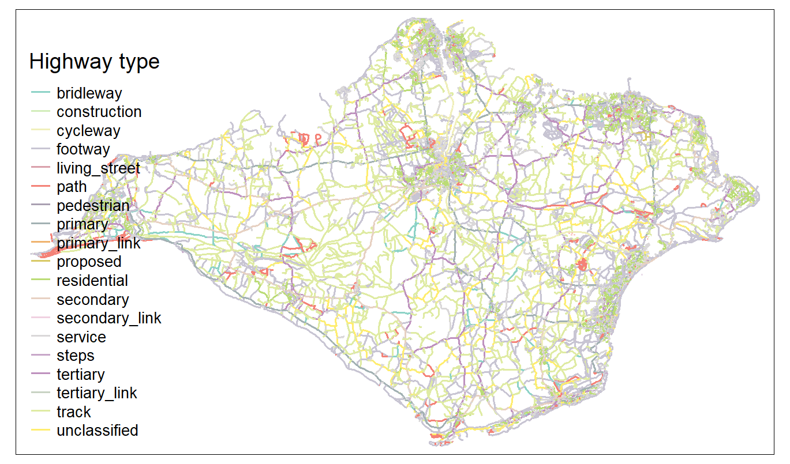
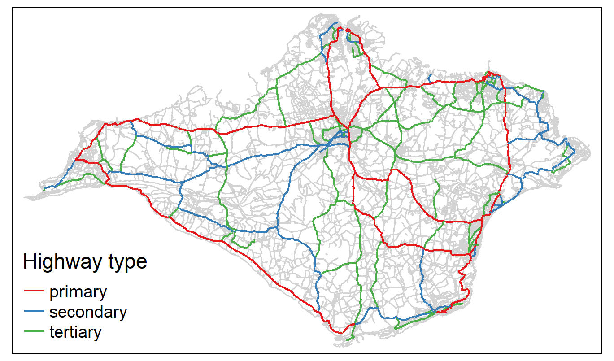
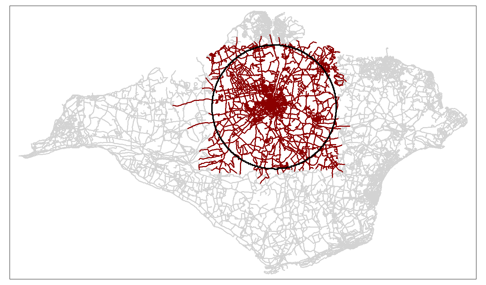
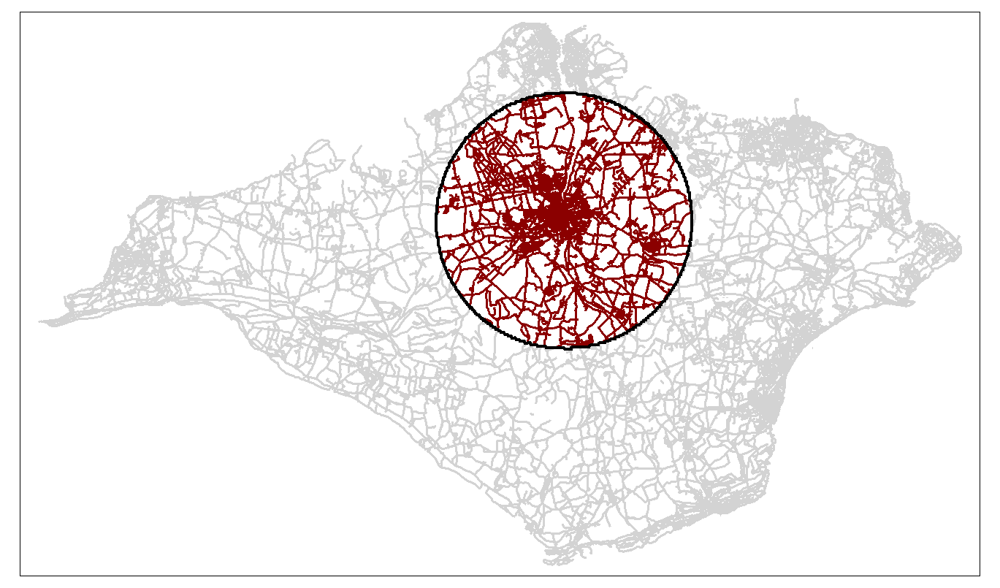
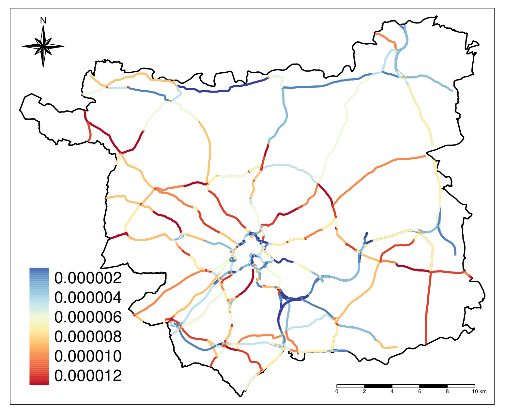
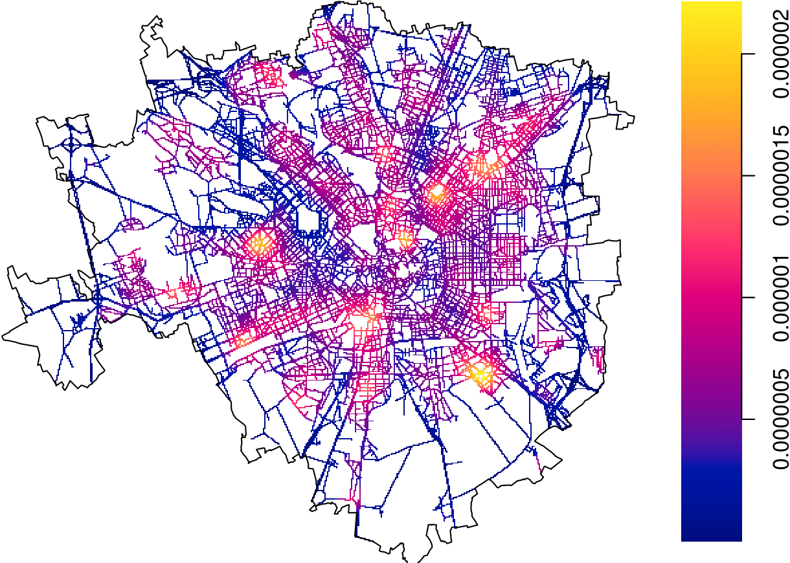

```{r setup, include = FALSE}
options(htmltools.dir.version = FALSE, crayon.enabled = TRUE)
knitr::opts_chunk$set(collapse = TRUE, fig.align = "center")

# packages
suppressPackageStartupMessages({
  library(tmap)
  library(leaflet)
})

Sys.setenv(OSMEXT_DOWNLOAD_DIRECTORY = tempdir())
```

## The initial development

.large[
  .pull-left[
  `osmextract` 📦 is the results of an international research collaboration: 

```{r, eval = FALSE}
locations = rbind(
  osmextract:::oe_search("Leeds"),
  osmextract:::oe_search("Milan"),
  osmextract::oe_search("Github") # ???
  osmextract:::oe_search("Toulouse")
)
tmap_leaflet(
  qtm(
    locations, 
    symbols.size = 2,
    symbols.col = "black",
    basemaps = providers$OpenStreetMap
  )
)
```

]
]

.pull-right[

```{r, echo = FALSE}
locations = rbind(
  osmextract:::oe_search("Leeds"),
  osmextract:::oe_search("Milan"),
  osmextract:::oe_search("Toulouse")
)
tmap_leaflet(
  qtm(
    locations, 
    symbols.size = 3,
    symbols.col = "black",
    basemaps = providers$OpenStreetMap
  )
)
```

]

???

Something about us and how we came to work on the project

---

## What is OpenStreetMap ? 

.large[
- OpenStreetMap (OSM) is an online database that provides open-access geographic and rich attribute data worldwide. 

- OSM is the ‘Wikipedia of maps’, with data continuously uploaded by millions of users. 

- OSM data represent a wide range of physical and, in particular, human features, including roads, rivers, buildings, coastal lines, political and administrative boundaries. 

- OSM data are used by several public and private agencies in several fields like transport planning, road safety analysis, and disaster response. 
]

---

## Install `osmextract`

.large[
The stable version of the package can be installed from [CRAN](https://cran.r-project.org/web/packages/osmextract/index.html) using the following command: 

```{r, eval = FALSE}
install.packages("osmextract")
```

The development verson can be installed from [github](https://github.com/ropensci/osmextract) as follows: 

```{r, eval = FALSE}
remotes::install_github("ropensci/osmextract")
```

The default behaviour of all functions in **`osmextract`** is to save the data into a temporary directory that is erased every time you restart `R`. 
You can set a persistent directory using the following code:  

```{r, eval = FALSE}
usethis::edit_r_environ()
# Add a line containing: OSMEXT_DOWNLOAD_DIRECTORY=/path/to/save/files
```
]

???

Explain differences between CRAN and github version
Mention the persistent directory stuff. 

---

## Load the 📦 

.large[
Loading the package raises an important message regarding the license associated with OSM data

```{r}
library("osmextract")
```

The function defined in our package return `sf` objects; hence, we will also load the package with the same name: 

```{r}
library("sf")
```
]

???

A few details on OSM data + a few words about sf v1.0

---

## OSM data providers

.large[
OSM data can be obtained mainly in two ways: 

1. querying OSM servers using the Overpass API; 
2. using pre-formatted extracts stored by external providers (such as [Geofabrik](http://www.geofabrik.de/data/download.html)). 

The popular `R` package **`osmdata`** defines a set of routines to quickly process OSM data downloaded from Overpass web server, while our package introduces a set of functions to work with OSM extracts directly from `R`. 

At the moment, we support the following external providers: 
```{r}
oe_providers(quiet = TRUE)
```
]

---

## The backbone of `osmextract`

.large[
The package is composed of the following main functions:

1. **`oe_match()`**: Match an input place with one of the files stored by the OSM providers;
2. **`oe_download()`**: Download the chosen file;
3. **`oe_vectortranslate()`**: Convert between `.pbf` and `.gpkg` formats;
4. **`oe_read()`**: Read `.pbf` and `.gpkg` files;
5. **`oe_get()`**: Match, download, (vector)translate, and import data, all in one step.

For simplicity, we will focus only on **`oe_get()`** and we refer to the introductory vignette for more details. 

Let's see a few examples! 
]

???

Explain the workflow

---

## `oe_get()`: Examples

.large[
**`oe_get()`** can be used to match an input place with one of the OSM extracts and import the corresponding data. For example: 

```{r}
isle_of_wight <- oe_get("Isle of Wight")
```
]

---

## `oe_get()`: Examples

.large[
We can also perform spatial matching using lon/lat coordinates (implicit CRS is `EPSG:4326`): 

```{r}
isle_of_wight <- oe_get(c(-1.305, 50.694))
```

The same operation can be performed using `sf` or `sfc` objects with any CRS. 
]

---

## `oe_get()`: Examples

.large[
If the input place cannot be matched with any OSM extract, then **`oe_get()`** calls the Nominatim API (via **`oe_match()`**) to geolocate the input and perform a spatial matching operation. 
For example: 

```{r}
oe_match("Olginate, Italy")
```
]

---

## `oe_get()`: Examples

.large[
.pull-left-40[
The most important argument in **`oe_get()`** is probably `vectortranslate_options`. 

We can tune the operations run during the vectortranslate process. 

```{r}
isle_of_wight <- oe_get(
  place = "Isle of Wight", 
  vectortranslate_options = c(
    "-t_srs", "EPSG:27700", 
    "-where", "highway IS NOT NULL" 
  ), 
  quiet = TRUE
)
```
]
]

```{r, include = FALSE}
if (FALSE) {
  raw_iow <- tm_shape(isle_of_wight) + 
    tm_lines(col = "highway", title.col = "Highway type", lwd = 2)  + 
    tm_layout(legend.title.size = 2.5, legend.text.size = 1.5)
  tmap_save(raw_iow, "figures-slides/raw_iow.png", dpi = 150)
}
```

.pull-right-60[

]

---

## `oe_get()`: Examples

.large[
.pull-left-40[
We can also apply SQL-like queries: 

```{r}
isle_of_wight_small <- oe_get(
  place = "Isle of Wight", 
  vectortranslate_options = c(
    "-t_srs", "EPSG:27700", 
    "-where", "highway IN 
    ('primary', 'secondary', 
    'tertiary')"
  ), 
  quiet = TRUE
)
```
]
]

```{r, include = FALSE}
if (FALSE) {
  small_iow <- 
    tm_shape(isle_of_wight) + 
      tm_lines(col = "lightgrey", lwd = 2) + 
    tm_shape(isle_of_wight_small) + 
      tm_lines(col = "highway", lwd = 3, title.col = "Highway type", palette = "Set1") + 
    tm_layout(legend.title.size = 2.25, legend.text.size = 1.5)
  tmap_save(small_iow, "figures-slides/small-iow.png", dpi = 150)
}
```

.pull-right-60[

]

---

## Most important features introduced in v0.3

.large[
A few weeks ago we release version 0.3 that introduces several new features: 

- Two new arguments in **`oe_get()`** named `boundary` and `boundary-type` for spatial filter operations; 

- The **`oe_match_pattern()`** function compares the input against all available OSM providers; 

- The **`oe_get_keys()`** function can be used to display all keys and corresponding values. 

- A logo 😍:


]

???

TESTME

---

## Boundary

.large[
.pull-left-40[
The `boundary` argument can be used to apply a spatial filter that selects all roads intersecting a given polygon 

```{r}
newport <- st_sfc(
  st_point(c(-1.29089, 50.6971)), 
  crs = 4326
)
newport <- st_buffer(newport, 5000)

isle_of_wight_spat <- oe_get(
  place = "Isle of Wight", 
  quiet = TRUE, 
  boundary = newport, 
  vectortranslate_options = c(
  "-where", "highway IS NOT NULL" 
  )
)
```
]
]

```{r, include=FALSE}
if (FALSE) {
  spat_iow <- tm_shape(isle_of_wight) + 
      tm_lines(col = "lightgrey", lwd = 2) + 
  tm_shape(isle_of_wight_spat) + 
    tm_lines(col = "darkred", lwd = 2) + 
  tm_shape(newport) + 
    tm_borders(col = "black", lwd = 3)
  
  tmap_save(spat_iow, "figures-slides/spat-iow.png", dpi = 150)
}
```

.pull-right-60[

]

---

## Boundary type

.large[
.pull-left-40[
The `boundary-type` argument can be used to select the type of spatial filter. The `clipsrc` option can be used to clip the geometries. 

```{r}
isle_of_wight_clip <- oe_get(
  place = "Isle of Wight", 
  quiet = TRUE, 
  boundary = newport, 
  boundary_type = "clipsrc", 
  vectortranslate_options = c(
    "-where", "highway IS NOT NULL",
    "-nlt", "PROMOTE_TO_MULTI"
  )
)
```
]
]

```{r, include=FALSE}
if (FALSE) {
  clip_iow <- tm_shape(isle_of_wight) + 
      tm_lines(col = "lightgrey", lwd = 2) + 
  tm_shape(isle_of_wight_clip) + 
    tm_lines(col = "darkred", lwd = 2) + 
  tm_shape(newport) + 
    tm_borders(col = "black", lwd = 3)
  
  tmap_save(clip_iow, "figures-slides/clip-iow.png", dpi = 150)
}
```

.pull-right-60[

]

---

## What can you do with it? I

.pull-left[
.large[
Speed limits of Roads in London: 
]
<div style="width: 550px; height: 385px; overflow: hidden;">

</div>
]

.pull-right[
.large[
Classification of cycleways in a region of Norway
]

]

---

## What can you do with it? II

.pull-left[
Road safety analysis in Leeds:


]

.pull-right[
Analysis of Ambulance interventions in Milan: 


]


---

## Thanks! 

### Thank you for attending this presentation. Thanks to `rOpenSci` for reviewing our package and all `R` users that helped us develop it. 

### How do you plan to use OSM extracts? Let us know! 

